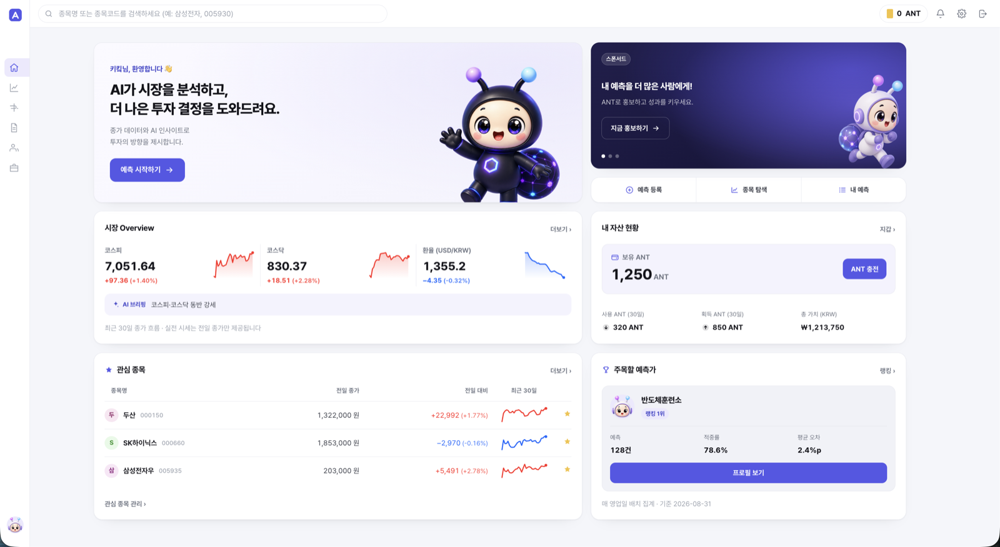
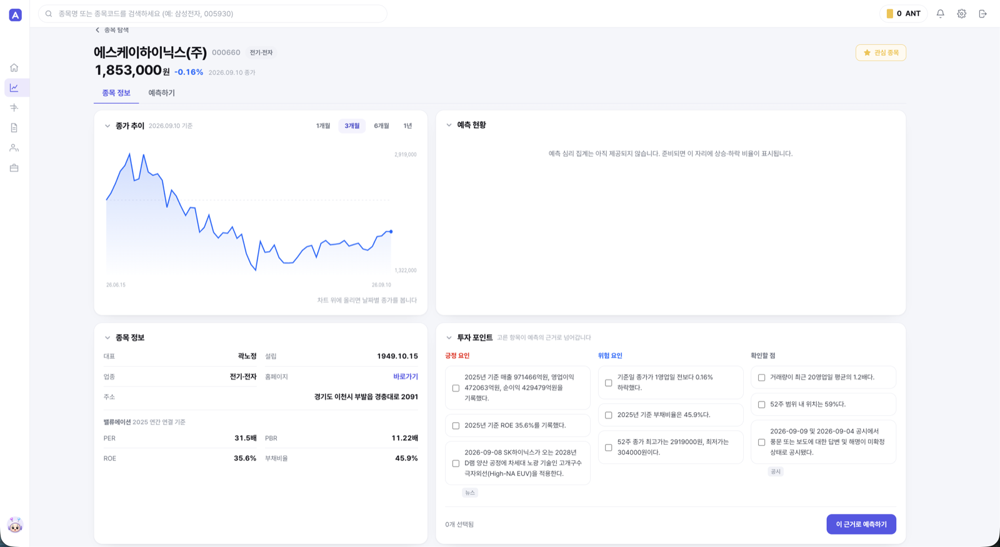
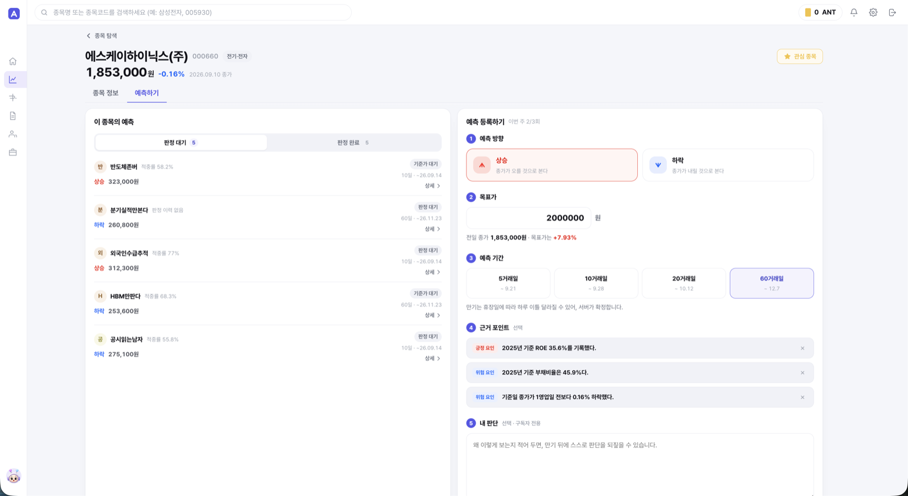
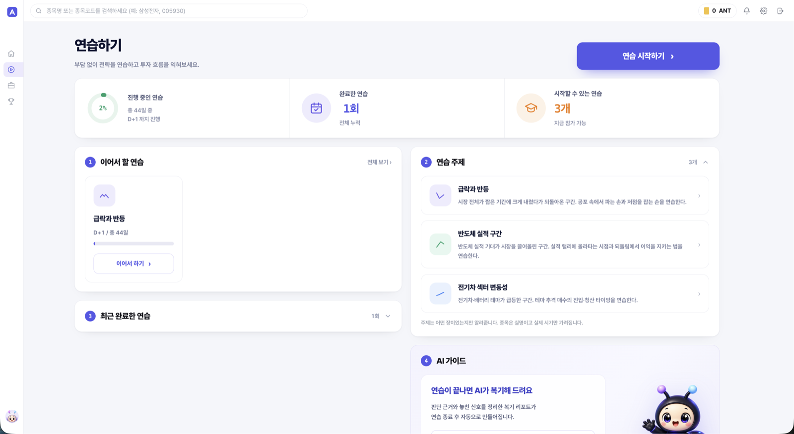
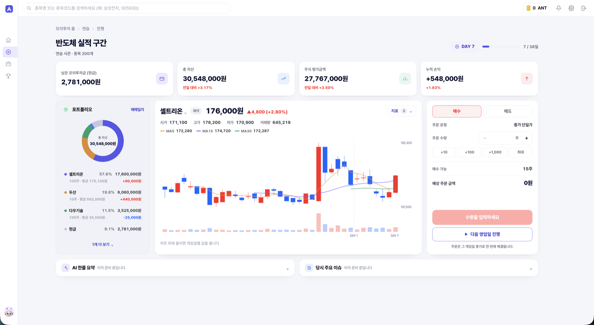

# 앤테나 (Antenna)

**근거를 보고 예측하는 AI 투자 플랫폼.** 종목에 대한 판단을 근거와 함께 남기고, 그 예측을 되돌릴 수 없게 블록체인에 봉인한 뒤, 만기에 실제 종가로 채점한다.

> SSAFY 15기 공통 프로젝트 · 팀 S15P21A507 · 서비스 <https://stock-antenna.com>

예측 플랫폼의 오래된 문제는 "맞힌 것만 기억되는 것"이다. 앤테나는 등록 시점에 예측·목표가·근거를 해시로 묶어 커밋하고, 매일 00:05 KST 그날의 커밋 전체를 머클트리로 묶어 루트 1건을 체인에 올린다. 루트가 올라간 뒤에는 서버도 예측을 고쳐 쓸 수 없다 — 고치면 머클 증명이 깨지기 때문이다. 사용자는 브라우저에서 3단계 검산(커밋 해시 재계산 → 머클 경로 검증 → 체인 `anchoredAt` 조회)을 직접 돌려 확인할 수 있다.

---

## 화면

| 로그인 | 인사이트 홈 |
|---|---|
|  |  |
| SSAFY · Google OAuth 2.0. 자체 가입 폼 없음 | 지수 3종 · AI 시장 브리핑 · ANT 잔액 · 관심 종목 · 예측가 랭킹 |

| 종목 상세 | 예측 등록 |
|---|---|
|  |  |
| 종가 추이 · 기업 개요 · 밸류에이션 · **투자 포인트**(고른 항목이 예측 근거로 넘어감) | 방향 · 목표가 · 기간 · 근거 포인트 · 지갑 서명 |

| 모의투자 — 연습 허브 | 모의투자 — 진행 |
|---|---|
|  |  |
| 성격별 연습 주제. **종목은 실명, 시기는 가림** | 게임일 단위 OHLCV · 포트폴리오 · 종가 단일가 주문 |

모의투자에서 시기를 감추는 이유는 단순하다. 연도를 알면 그다음에 무슨 일이 있었는지 아는 상태로 시작하게 되어 예측이 아니라 복기가 된다. `seasons.base_date` 는 서버 전용이며 어떤 응답에도 싣지 않는다.

---

## 기능

| 영역 | 내용 |
|---|---|
| **인사이트** | 지수·환율, 종목 탐색·상세, 관심 종목, DART 기반 기업 개요·재무·밸류에이션, AI 시장 브리핑 |
| **예측** | 방향·목표가·기간(7/14/30/90일) 등록, 근거 포인트 첨부, 하루 무료 3건 초과는 ANT 소각, 만기 자동 판정 |
| **온체인 검증** | 커밋 원장, 앵커 배치 상세, 예측별 3단계 검산 |
| **채널·구독** | 예측가 랭킹(실전/리플레이 트랙), 채널 프로필·백테스트, 유료 구독으로 근거 열람 |
| **리포트·커뮤니티** | 리포트 발행(공개 범위 선택), 글·댓글·공감, 신고 |
| **모의투자** | 과거 구간 재생 연습, 게임일 진행, 매매일지, 리더보드, AI 복기 리포트, 배지 |
| **지갑·토큰** | 지갑 연동(nonce 서명), ANT 잔액·원장, 광고 게재료 소각 |
| **관리자** | 신고 처리, 회원 제재, 시즌 운영 |

ANT 토큰 금액표 — 가입 보너스 10,000 · 슬롯 초과 1건 1,000 소각 · 광고 하루치 1,000 소각.

---

## 아키텍처

```
                ┌───────────────────────────────────────────────┐
  브라우저 ────▶│ nginx (TLS · certbot webroot)                  │
                │   /        → React 정적 빌드                    │
                │   /api/v1  → Spring Boot                       │
                └───────────────────┬───────────────────────────┘
                                    │
             ┌──────────────────────┼──────────────────────┐
             ▼                      ▼                      ▼
      PostgreSQL 18            Redis 8              SSAFY EVM 체인
      (도메인 51 엔티티)        (캐시·nonce)          CommitAnchor v3
                                                    PredictToken (ANT)
                                    ▲
                    배치 9종 ────────┘
        일봉·지수·환율 수집 · DART 공시 · 뉴스 수집 · 관련도 판정(GPU)
        예측 판정 · 랭킹 집계 · 앵커 전송 · 앵커/토큰 인덱싱
```

**외부 연동** — 공공데이터포털(일봉·지수), 한국수출입은행(환율), DART(공시·재무), 네이버 뉴스 API, 교내 GPU vLLM(뉴스 관련도 판정), GMS OpenAI 호환 게이트웨이(브리핑 생성).

### 블록체인 설계

`contracts/CommitAnchor.sol` (Solidity 0.8.28, evmVersion=paris)

- 장부 칸의 키가 **머클루트 자체**다 (`_anchoredAt[merkleRoot] = block.number`). DB 배치 번호가 체인에 가지 않으므로 DB 를 초기화하거나 여러 DB 가 한 컨트랙트를 써도 칸이 부딪히지 않는다.
- 앵커 tx 에 그 배치의 **커밋 해시 전량**을 싣는다. 컨트랙트가 리프로 루트를 다시 계산해 서버가 준 루트와 대조하고(`RootMismatch`), 해시 목록을 `Anchored` 이벤트로 남긴다. **이벤트가 곧 백업이다** — DB 없이 체인만 읽어 트리와 증명 경로를 되살릴 수 있다(`scripts/rebuild-from-chain.mjs`).
- 키를 둘로 나눈다. 관리자 키는 `grantRole`/`revokeRole` 만 하고 **앵커는 못 한다**. 릴레이어 키는 `anchor` 만 한다. 릴레이어 키가 새도 피해는 "쓰레기 루트를 올린다"까지고, 관리자 키로 롤을 갈아 끼우면 재배포 없이 끝난다. 서버 코드는 어느 환경에서도 관리자 키를 읽지 않는다.

`PredictToken.sol` 은 ERC-20 기반 ANT 토큰. 가입 보너스 mint, 슬롯 초과·광고 게재료 burn 을 릴레이어가 대납한다.

### 설계상 정한 것

- 실전 시세는 **전일 종가만** 쓴다. 일중·분봉·호가 없음. OHLCV 는 모의투자에만 있다.
- 예측·근거에 **수정·삭제 API 가 없다**. 되돌릴 수 없는 POST 8종은 `Idempotency-Key` 필수.
- 온체인을 동반하는 요청은 `202 + operationId` 를 주고 클라이언트가 폴링한다.
- 목록은 전부 커서 페이징. 페이지 번호 없음(예외는 랭킹 `fromRank`).

---

## 기술 스택

| 구분 | 사용 |
|---|---|
| Backend | Java 21 · Spring Boot 4.1.1 (WebMVC · Data JPA · Data Redis · Security OAuth2 Client/Resource Server · Actuator) · web3j 4.14 · Gradle |
| Frontend | React 19 · TypeScript 6 · Vite 8 · React Router 7 · ethers 6 · oxlint |
| Data | PostgreSQL 18 (ICU ko-KR) · Redis 8 |
| Chain | Solidity 0.8.28 · Hardhat · SSAFY EVM (chainId 31221) · 로컬 Hardhat (31337) |
| Infra | Docker Compose · nginx · Let's Encrypt(certbot webroot) · GitLab CI 셀프호스트 러너 |
| Test | JUnit 5 · Testcontainers(PostgreSQL) · H2 · 테스트 클래스 98개 |

---

## 저장소 구조

```
backend/     Spring Boot — domain/{account,auth,chain,community,market,monetize,
             prediction,ranking,research,season,upload} · common/{ai,error,idempotency,security}
frontend/    React — pages 45개 라우트 · api(도메인별 클라이언트) · chain · sim · wallet
contracts/   CommitAnchor.sol · PredictToken.sol · Hardhat · 배포/복구 스크립트
infra/       nginx 설정
docs/        API 명세서 · ERD · 화면설계서 · 기술 아키텍처
```

---

## 로컬 실행

```bash
# 1. DB · 캐시
docker compose up -d

# 2. 체인 (컨트랙트를 건드릴 때만)
cd contracts && npm install && npx hardhat node   # 터미널 1 · chainId 31337
npm run deploy:local                              # 터미널 2

# 3. 백엔드
cp backend/.env.example backend/.env              # 외부 API 키·체인 주소를 채운다
cd backend && ./gradlew bootRun

# 4. 프론트엔드
cp frontend/.env.example frontend/.env
cd frontend && npm install && npm run dev
```

검증:

```bash
cd backend  && ./gradlew test          # 실호출 E2E 는 --tests 로 지목할 때만 돈다
cd frontend && npm run typecheck && npm run lint
cd contracts && npm test               # 103케이스 · Java 픽스처와 크로스 검증
```

비밀값은 전부 환경변수로 받는다. 저장소에는 `.env.example` 만 있고 키가 들어 있지 않다.

---

## 진행 상황

동작하는 것 — OAuth 로그인·지갑 연동, 종목 탐색·상세, 예측 등록·판정·3단계 검산, 앵커 배치·인덱싱, ANT 토큰 발행·소각, 채널·구독, 리포트·커뮤니티, 랭킹, 모의투자 연습(주문·게임일 진행·매매일지·결과), 광고 게재, 관리자 화면.

REST 엔드포인트 68개(컨트롤러 26개), 도메인 엔티티 51개, 배치 9종이 올라가 있고 운영 체인에 CommitAnchor v3 와 PredictToken 이 배포돼 있다.

작업 중 — 시즌 뉴스(`GET /seasons/{id}/news`)와 게임일별 AI 시장 요약, 통합 검색, 예측 심리 집계. 화면에 "아직 준비 중입니다" 로 비워 둔 자리가 그 자리다.

상세 문서는 [`docs/`](docs) — API 명세서 · ERD · 화면설계서(42화면 · 10모달 · 9영역).
