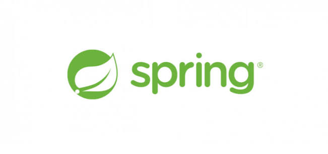
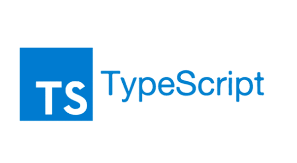
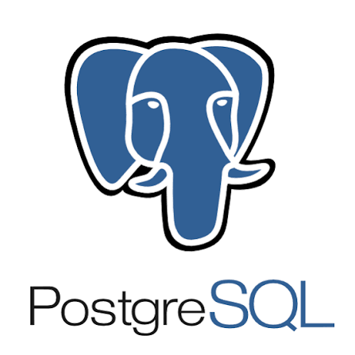
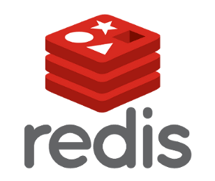
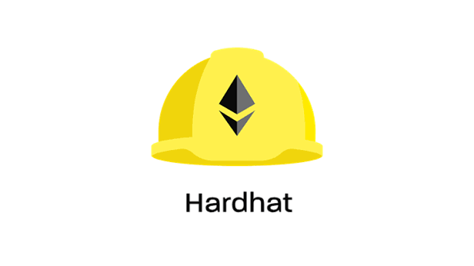
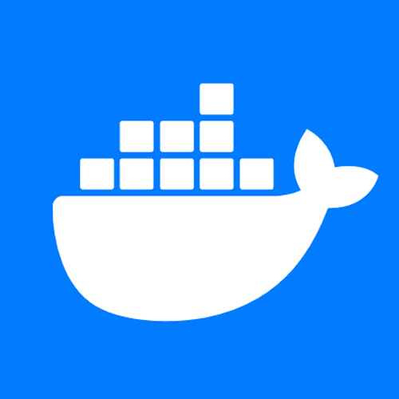
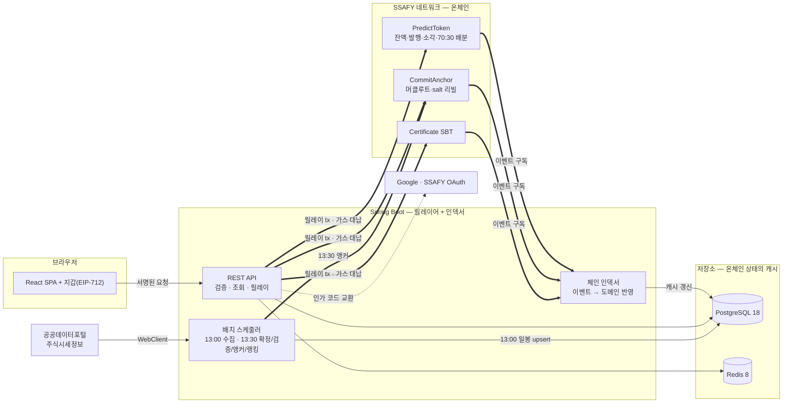
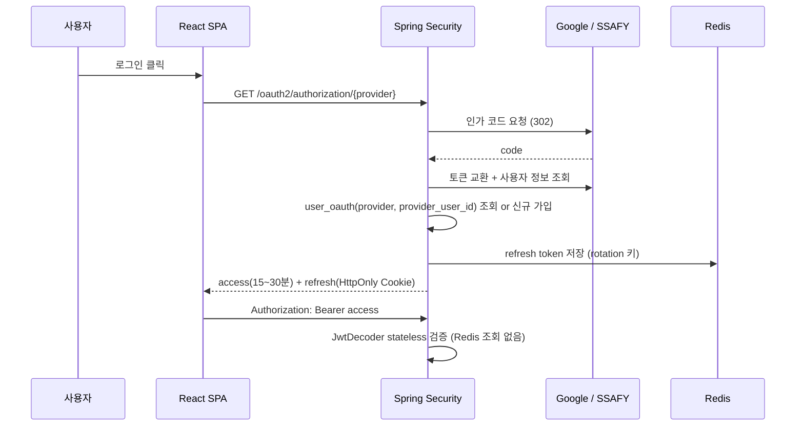

# 엔테나(Antenna) — 기술 스택 · 시스템 아키텍처

작성 2026-08-24 · SSAFY 15기 S15P21A507 · 기준 문서 「엔테나 구현 기획서」 · 서버 착수 전, 프로토타입 v2 기준

<p align="center">
  &nbsp;&nbsp;
  &nbsp;&nbsp;
  &nbsp;&nbsp;
  &nbsp;&nbsp;
  &nbsp;&nbsp;
  &nbsp;&nbsp;
  &nbsp;&nbsp;
  &nbsp;&nbsp;
  &nbsp;&nbsp;
  &nbsp;&nbsp;
  &nbsp;&nbsp;
  
</p>

---

## 1. 설계를 지배하는 원칙

아키텍처의 대부분은 취향이 아니라 제약과 원칙에서 나왔다. 배경을 모르면 되돌리기 쉬우므로 먼저 적는다.

### 1-1. 규제 제약 3종

| 제약 | 아키텍처에 남긴 흔적 |
|---|---|
| 시세 재배포 금지 (증권사·KRX Open API) | 외부 시세는 공공데이터포털 일봉 **단 하나**. 실시간 스트리밍 채널이 시스템에 없고, 현재가를 화면에 표출하지 않는다 — 모든 가격은 "직전 영업일 종가" |
| 증권사 모의투자 API는 계정당 계좌 1개 | 주문·체결·잔고·손익을 **서버가 직접 계산**(모의 체결·손익 정산 엔진). 증권사로 나가는 주문 0건 |
| 유사투자자문업 · 선불전자지급수단 | 결제(PG) 모듈 없음. PRT는 **환금 불가** — 구현 못 한 것이 아니라 설계상 배제 |

### 1-2. 온체인 / 오프체인 경계

판단 기준은 하나 — **플랫폼이 거짓말할 수 있는 자리인가.** 머클루트만 올리는 설계는 블록체인이 "서버가 한 일에 도장만 찍는" 공증에 머물렀다. 플랫폼이 배분율을 70%에서 40%로 몰래 바꿔도 잡히지 않는다. 그래서 토큰의 소비·수급과 배분 규칙을 컨트랙트로 옮긴다.

| 항목 | 위치 | 이유 |
|---|:---:|---|
| PRT 잔액·발행·소각 | **온체인** | DB 숫자면 플랫폼이 무한정 찍어낼 수 있다 |
| 구독 결제 + 70:30 배분 | **온체인** | 가장 중요. 배분율 조작이 DB 구조로는 안 잡힌다 |
| 토큰 소각 (슬롯·백테스트·증명서·참가비) | **온체인** | 잔액이 온체인이면 자동으로 따라온다 |
| 검증 증명서 | **온체인** | SBT로 발급하면 플랫폼이 망해도 지갑에 남는다 |
| 예측 커밋 머클루트 · salt 리빌 | **온체인** | 제3자가 해시 재계산으로 직접 검증 |
| 리플레이 시즌 예수금·매매·포지션 | 오프체인 | PRT가 아닌 별도 가상 화폐, 게임일마다 발생해 빈도가 높다 |
| 예측 근거·리포트 원문 | 오프체인 | 유료 비공개가 수익 모델의 전제 |
| 공공데이터 일봉 · 시즌 합성 시세 | 오프체인 | 재배포 제약 + 검증할 신뢰 문제가 없다 |
| 계정·프로필·구독 상태 | 오프체인 | 신뢰 문제가 아니다. 지갑 주소 매핑만 DB에 |

> **한계를 먼저 밝힌다** — 적중·실패 판정은 온체인으로 옮길 수 없다. 컨트랙트가 한국 주식 종가를 알 수 없고 해당 오라클이 없다. 서버가 판정하고 결과 해시만 올린다. 완화책으로 **판정 입력값(만기일 종가)을 앵커에 함께 기록**해 누구나 공공데이터포털과 대조하여 사후 적발할 수 있게 한다.

### 1-3. MarketClock

> 예측 등록·검증·랭킹 로직은 시간을 `MarketClock`에서만 얻는다.
> 실제 영업일 시계인지 리플레이 게임일 시계인지 도메인 로직은 알지 못한다.

```
MarketClock (인터페이스)
├─ RealClock    : 영업일 단위, 13:30 배치, 공공데이터 일봉
└─ ReplayClock  : 게임일 단위, N초마다 tick, 재생 시계열
```

이 설계 덕분에 시연에서 만기를 기다리지 않고 전체 사이클을 30초 안에 보여줄 수 있다. 시연용 우회가 아니라 설계 결과물이다.

---

## 2. 기술 스택

확정 항목만. 버전은 2026-08-24 기준 실제 빌드가 통과한 값(`backend/build.gradle`, `frontend/package.json`, `docker-compose.yml`).

<table>
  <tr>
    <th align="left" width="130">영역</th>
    <th align="center" width="110">스택</th>
    <th align="left">구성 · 역할</th>
  </tr>
  <tr>
    <td><b>백엔드</b></td>
    <td align="center"><br/><sub><b>Spring Boot 4.1.1</b></sub></td>
    <td>Java 21 · MVC + JPA. WebClient는 공공데이터 수집 전용.<br/>서버의 역할은 <b>릴레이어 + 인덱서</b> — 잔액의 소유자가 아니다</td>
  </tr>
  <tr>
    <td rowspan="2"><b>프론트엔드</b></td>
    <td align="center"><br/><sub><b>React 19</b></sub></td>
    <td>Vite 8 기반 SPA. 백엔드가 별도 API 서버라 SSR 불필요</td>
  </tr>
  <tr>
    <td align="center"><br/><sub><b>TypeScript 6</b></sub></td>
    <td>프로토타입 <code>engine/types.ts</code>의 도메인 타입을 이어받는다 · 린트 oxlint</td>
  </tr>
  <tr>
    <td rowspan="2"><b>데이터</b></td>
    <td align="center"><br/><sub><b>PostgreSQL 18</b></sub></td>
    <td>ICU <code>ko-KR</code> · UTF8 · <code>Asia/Seoul</code>. 원장·시세·시즌의 저장소이자 <b>온체인 상태의 캐시</b></td>
  </tr>
  <tr>
    <td align="center"><br/><sub><b>Redis 8</b></sub></td>
    <td>refresh token(회전·재사용 탐지) · 랭킹 스냅샷 · 일봉 캐시.<br/>appendonly off, 256mb, allkeys-lru</td>
  </tr>
  <tr>
    <td rowspan="3"><b>블록체인</b></td>
    <td align="center"><br/><sub><b>Solidity</b></sub></td>
    <td>PredictToken(전송 불가 ERC-20) · CommitAnchor · Certificate SBT(ERC-721) · SeasonPrizePool(여유 시)</td>
  </tr>
  <tr>
    <td align="center"><br/><sub><b>Hardhat</b></sub></td>
    <td>컴파일 · 테스트 · 배포</td>
  </tr>
  <tr>
    <td align="center"><br/><sub><b>SSAFY 네트워크<br/>(대체: Polygon Amoy)</b></sub></td>
    <td>지갑은 <b>SSAFY WALLET</b>(MetaMask 기반, SSAFY 제공) · 가스 토큰은 SSAFY 지급분 사용.<br/>SSAFY 네트워크 미지원 상황의 대체 후보가 Polygon Amoy(가스비 0).<br/>서버 연동은 <b>web3j 4.14.0</b> — 컨트랙트 바인딩 · 이벤트 구독</td>
  </tr>
  <tr>
    <td rowspan="2"><b>인증</b></td>
    <td align="center"><br/><sub><b>Google OAuth 2.0</b></sub></td>
    <td rowspan="2">OAuth 2.0 로그인 2종 + 자체 JWT(Nimbus JOSE 내장 — 별도 JWT 라이브러리 없음).<br/>SSAFY는 OIDC discovery가 없을 수 있어 <code>authorization-uri</code>·<code>token-uri</code>·<code>user-info-uri</code>·<code>user-name-attribute</code> 직접 설정</td>
  </tr>
  <tr>
    <td align="center"><br/><sub><b>SSAFY OAuth 2.0</b></sub></td>
  </tr>
  <tr>
    <td><b>외부 데이터</b></td>
    <td align="center"><br/><sub><b>DART 공시 API</b></sub></td>
    <td>공공데이터포털 「금융위원회_주식시세정보」 일별 OHLCV(시세 유일 출처) + DART 공시(AI 리포트 · RAG, 파인튜닝 없음 — 미결정 항목)</td>
  </tr>
  <tr>
    <td><b>인프라</b></td>
    <td align="center"><br/><sub><b>Docker Compose</b></sub></td>
    <td>DB·Redis만 컨테이너. 앱은 로컬 실행</td>
  </tr>
</table>

### Gradle 의존성

```groovy
implementation 'org.springframework.boot:spring-boot-starter-webmvc'
implementation 'org.springframework.boot:spring-boot-starter-webclient'
implementation 'org.springframework.boot:spring-boot-starter-data-jpa'
implementation 'org.springframework.boot:spring-boot-starter-data-redis'
implementation 'org.springframework.boot:spring-boot-starter-validation'
implementation 'org.springframework.boot:spring-boot-starter-security-oauth2-client'
implementation 'org.springframework.boot:spring-boot-starter-security-oauth2-resource-server'
implementation "org.web3j:core:4.14.0"
runtimeOnly    'org.postgresql:postgresql'

// Spring Boot 4에서 spring-boot-starter-web / -oauth2-client 는 deprecated.
// 각각 -webmvc / -security-oauth2-client 가 정식 이름이다.
```

> 정리 필요: `build.gradle`에 남아 있는 `runtimeOnly 'com.mysql:mysql-connector-j'`는 제거 대상 — DataSource는 PostgreSQL 하나다.

### 프론트에 추가가 필요한 것

현재 프론트는 자체 `engine/` 위 프로토타입이라 라우터도 데이터 페칭 계층도 없다.

- **react-router** — 증명서 공개 링크·프로필 딥링크가 URL을 요구한다
- **TanStack Query** — 랭킹·피드·시즌·구독 상태 폴링(PENDING → ACTIVE). 전역 상태 라이브러리는 불필요
- **지갑 연동** — EIP-712 서명(예측 등록)과 SIWE(지갑 링크). viem 등 경량 클라이언트 1개

---

## 3. 시스템 아키텍처

서버는 잔액의 소유자가 아니라 **릴레이어 + 인덱서**다. 컨트랙트가 잔액을 들고 배분 규칙을 집행하고, 서버는 트랜잭션을 대신 보내고(가스 대납) 이벤트를 받아 DB에 캐시한다.

### 3-1. 전체 구성

<table>
  <tr>
    <td align="center" width="24%" valign="top">
       
      <br/><b>브라우저 — React SPA</b><br/>
      <sub>+ 지갑 (EIP-712 서명)</sub>
    </td>
    <td align="center" width="8%">→<br/><sub>서명된 요청<br/>(HTTPS + JWT)</sub></td>
    <td align="center" width="30%" valign="top">
      
      <br/><b>Spring Boot API</b><br/>
      <sub>검증 · 조회 · <b>릴레이</b> (가스 대납)<br/>배치 스케줄러 13:00 / 13:30<br/>체인 인덱서 (이벤트 → DB 캐시)</sub>
    </td>
    <td align="center" width="8%">⇄<br/><sub>릴레이 tx ↑<br/>이벤트 구독 ↓</sub></td>
    <td align="center" width="30%" valign="top">
       
      <br/><b>SSAFY 네트워크 — 온체인</b><br/>
      <sub>PredictToken (잔액 · 70:30 배분)<br/>CommitAnchor (머클루트 · 리빌)<br/>Certificate SBT · 지갑: SSAFY WALLET</sub>
    </td>
  </tr>
  <tr>
    <td align="center" valign="top">
       
      <br/><b>OAuth 프로바이더</b><br/><sub>구글 · SSAFY 로그인</sub>
    </td>
    <td align="center">↘</td>
    <td align="center" valign="top">
       
      <br/><b>저장소</b><br/>
      <sub>PostgreSQL — 온체인 상태의 캐시 + 원장·시세·시즌<br/>Redis — refresh token · 랭킹 스냅샷</sub>
    </td>
    <td align="center">↖</td>
    <td align="center" valign="top">
       
      <br/><b>외부 데이터 · 인프라</b><br/>
      <sub>공공데이터포털 일봉 (13:00 수집) · DART 공시<br/>Docker Compose (DB·Redis)</sub>
    </td>
  </tr>
</table>



**읽는 법** — 굵은 화살표 순환(컨트랙트 → 인덱서 → 저장소)이 이 설계의 핵심이다. **잔액의 진실은 온체인에 있고 DB는 조회 속도를 위한 사본이다.** 서버가 DB를 고쳐도 다음 인덱싱에서 되돌아온다.

### 3-2. 컨트랙트 구성

```
PredictToken            ERC-20, 전송 불가
  ├ mint / burn         가입 보너스 · 시즌 상금 / 슬롯·백테스트·증명서·참가비
  └ subscribe()         구독료 수납 → 예측자 70% · 플랫폼 30% 자동 배분

CommitAnchor            머클루트 앵커링 + salt 리빌 이벤트
PredictionCertificate   ERC-721 SBT, 검증 증명서
SeasonPrizePool         참가비 적립 → 시즌 종료 시 규칙대로 분배   (여유 시)
```

**전송 불가 토큰** — PRT는 ERC-20이되 `transfer`·`transferFrom`·`approve`가 revert 한다. 전송 가능하면 플랫폼이 환금을 제공하지 않아도 P2P 2차 시장이 생기고 "환금 불가는 설계상 배제"라는 규제 방어선이 무너진다. `balanceOf`는 정상 동작하므로 지갑에 잔액은 보이고 전송만 막힌다 — 의도적 표준 이탈임을 명시한다. 발표 문안: *약관이 아니라 컨트랙트로 강제했습니다.*

---

## 4. 백엔드 패키지 구조

```
ssafy.a507.backend
├─ common
│  ├─ config        # SecurityConfig, WebClientConfig, RedisConfig, SchedulerConfig, ChainConfig
│  ├─ error         # { code, message, field } 통일 오류 응답
│  ├─ clock         # ★ MarketClock, RealClock, ReplayClock
│  └─ crypto        # 커밋 해시, MerkleTree, EIP-712 서명 검증
├─ auth             # OAuth2 성공 핸들러, JwtIssuer, RefreshTokenStore(Redis, 회전·재사용 탐지)
├─ user             # users, user_oauth, user_wallet (SIWE nonce·링크)
├─ market           # stocks, daily_quotes, 수집 배치(날짜별 basDt upsert)
├─ prediction       # predictions, prediction_notes, prediction_commits, 검증 배치
├─ anchor           # anchor_batches, 머클 구성, CommitAnchor 릴레이
├─ chain            # ★ chain_events 인덱서, token_balances/token_ledger 캐시, 가스 대납 릴레이어
├─ subscription     # subscriptions (PENDING → ACTIVE), subscribe() 릴레이
├─ certificate      # certificates, SBT 발급 릴레이
├─ ranking          # ranking_snapshots, batch_runs, Redis 캐시
├─ backtest         # 팔로우 백테스트 (1,000 PRT 소각 동반)
├─ season           # seasons, season_tickers/prices, 참가·모의 체결·손익 정산, 블록 부트스트랩
└─ report           # reports (구독자 전용 열람)
```

**지켜야 할 규칙 둘.**

1. `prediction`·`ranking`·`season` 도메인 코드에 `LocalDate.now()` 금지 — 시간은 `MarketClock`으로만. 깨지는 순간 리플레이 트랙에 실전 날짜가 새어 들어가고, 시연의 실전 전환 장면이 성립하지 않는다.
2. `chain` 패키지 밖에서 `token_balances`를 직접 쓰지 않는다 — 갱신 주체는 인덱서 하나. 이 방향이 뒤집히면 "DB는 캐시" 설계가 무너진다.

```java
public interface MarketClock {
    int currentDay();                        // 영업일 / 게임일 인덱스
    LocalDate resolveDate(int day);          // REPLAY 는 시즌 가상일자
    BigDecimal closeOf(String instrument, int day);
}
```

---

## 5. 배치 파이프라인

매 영업일 두 번 돈다. 공공데이터는 **종목별이 아니라 날짜별로 수집** — `basDt` 하나로 그날 전 종목이 나오므로 3년치가 약 740일 × 1~3콜이면 끝나고 일 1만 건 제한에 여유롭다. `(기준일자, 종목코드)` 유니크 키 upsert로 멱등. 공휴일·거래정지는 데이터 없음이 정상.

| 시각 (KST) | 작업 | 내용 |
|:---:|---|---|
| **13:00** | 일봉 수집 | 직전 영업일 전 종목 OHLCV → `daily_quotes` upsert |
| **13:30** | 기준가 확정 | `status=BASE`이고 `base_date` 도래한 예측의 기준가를 당일 종가로 확정 → `OPEN` |
| | 만기 검증 | `status=OPEN`이고 만기 지난 예측 판정 → `HIT`/`MISS`, 목표가 오차 산출 |
| | 머클 앵커 | 앵커 대기 커밋으로 머클트리 구성 → root 1건만 온체인 전송 |
| | salt 리빌 | 만기 도달 예측의 salt 공개 → 제3자 검증 가능 |
| | 랭킹 산출 | 트랙 × 필터 조합별 신뢰도 재계산 → `ranking_snapshots` + Redis |

> **기준가 2단계 확정** — 등록 시점에는 기준가를 정하지 않고 **다음 영업일 종가로 확정**한다. 장중 정보를 보고 등록하면서 기준가만 전일 종가면 하루치 정보 우위가 생긴다. 커밋-리빌과 자연스럽게 맞물린다.

배치 실행 기록은 `batch_runs`(영업일당 1행 UNIQUE)에 남긴다 — 중복 실행 방지와 시연 재현이 목적. 검증 배치는 **해당 일자 시세가 없으면 판정을 미룬다**(오판보다 지연이 낫다).

---

## 6. 인증 · 인가

인증 등급 3단계. 읽기는 대부분 열려 있다.

| 등급 | 요구 | 적용 |
|---|---|---|
| 공개 | 없음 | 피드·랭킹·원장 탐색·시세·프로필 — 심사위원이 지갑 없이 보는 범위 |
| JWT | `Authorization: Bearer` | 근거 열람(+구독), 내 정보, 시즌 주문 |
| 서명 | JWT + EIP-712 지갑 서명 | **토큰이 움직이는 곳 전부** — 예측 등록, 구독, 증명서, 백테스트, 시즌 참가 |



- **access token은 서버에 저장하지 않는다** — stateless 검증이 JWT의 존재 이유.
- **refresh token만 Redis** — 회전·재사용 탐지·강제 로그아웃이 서버 상태를 요구. 재사용 탐지 시 계정 전체 폐기 여부는 미결정.
- **계정 자동 병합 금지** — 프로바이더가 이메일을 검증했다는 보장이 없다. 병합은 로그인 상태에서의 명시적 계정 연동으로만.
- **지갑 벽은 예측 등록(및 토큰 이동) 앞에만** — OAuth 도입 목적이 온보딩 허들 완화다. 로그인 직후 지갑을 요구하면 그 목적이 무너지고, 심사위원도 지갑 없이 시연 대부분을 볼 수 있어야 한다.

---

## 7. 외부 연동 실패 정책

| 연동 | 실패 시 |
|---|---|
| 공공데이터 시세 | 수집 로그에 FAIL 기록, 다음 회차 재시도. 검증 배치는 데이터 없으면 판정 보류 |
| SSAFY 네트워크 (체인) | 커밋·주문은 이미 DB에 있으므로 서비스 정상. 앵커·결제 상태만 `PENDING` 유지, 인덱서가 따라잡는다 |
| Google / SSAFY OAuth | 로그인 실패 화면. 기존 세션은 JWT로 계속 동작 |
| DART / LLM (미결정 기능) | 리포트 생성 실패로 국한. **수치는 결정론적 코드가 이미 계산**하므로 지표 표시는 무관 |

외부가 전부 죽어도 이미 등록된 예측의 조회·원장 검증·리플레이 시즌은 계속 돈다 — 시연 리스크 관리 차원에서 의도적으로 유지한다.

---

## 8. 배포 구성 · 환경 변수

```
개발 · 시연
├─ docker compose   → postgres:18-alpine, redis:8-alpine
├─ ./gradlew bootRun  (Spring Boot, :8080)
└─ npm run dev        (Vite, :5173 → /api 프록시)

컨트랙트
└─ Hardhat 컴파일·테스트 → SSAFY 네트워크 배포 → 주소·ABI 를 서버 설정으로 주입
```

**지갑·체인 (2026-08-24 추가 결정)**
- 지갑은 **SSAFY WALLET** — SSAFY가 제공하는 MetaMask 기반 지갑. 사용자 지갑 연동(SIWE)·EIP-712 서명 모두 이것 기준.
- 가스 토큰은 **SSAFY 측 지급분**을 사용한다. 자체 가스 재원이 없어도 되므로 릴레이어의 가스 대납 부담이 낮다.
- SSAFY 네트워크 사용이 막히는 경우의 대체 후보만 Polygon Amoy(테스트넷, 가스비 0). 컨트랙트 코드는 어느 쪽이든 동일(EVM).

`.env` 하나를 docker compose와 백엔드가 함께 읽는다(`.env.example`). 서버가 추가로 요구하는 값:

| 키 | 용도 |
|---|---|
| `ODP_SERVICE_KEY` | 공공데이터포털 인증키 |
| `OAUTH_GOOGLE_CLIENT_ID` / `_SECRET` | 구글 로그인 |
| `OAUTH_SSAFY_CLIENT_ID` / `_SECRET` / `_AUTH_URI` / `_TOKEN_URI` / `_USERINFO_URI` | SSAFY 로그인 |
| `JWT_PRIVATE_KEY` / `JWT_PUBLIC_KEY` | 자체 JWT 서명 키쌍 |
| `CHAIN_RPC_URL` / `CHAIN_RELAYER_KEY` | SSAFY 네트워크 RPC · 릴레이어 키 (가스는 SSAFY 지급 토큰) |
| `TOKEN_CONTRACT` / `ANCHOR_CONTRACT` / `CERT_CONTRACT` | 배포된 컨트랙트 주소 |
| `DART_API_KEY` / `LLM_API_KEY` | AI 리포트 (미결정 기능) |

---

## 9. AI 사용 원칙 (미결정 기능이지만 원칙은 확정)

수치는 **반드시 결정론적 코드**가 계산하고, LLM은 그 숫자를 받아 서술 문단만 생성한다. LLM이 수치를 만들면 증명서의 존재 이유가 무너진다. 출력에서 종목 추천·미래 예측은 금지하고 과거 사실 서술로 제한한다(투자자문업 회피). DART 공시 기반 RAG, 파인튜닝 없음.

---

## 10. 구현 순서

컨트랙트부터 쓰고 싶겠지만 **스키마가 먼저다.** 온체인 설계가 스키마를 바꾸므로, 스키마 없이 컨트랙트만 쓰면 나중에 양쪽을 다 고친다.

| # | 단계 | 핵심 |
|---|---|---|
| 1 | 공공데이터 수집 파이프라인 | 날짜별 수집 + 멱등 upsert. 3년치가 리플레이 시즌 재료가 된다 |
| 2 | 도메인 스키마 | [ERD](02-erd.md) 전체. 온체인 캐시 테이블(`chain_events`·`token_balances`·`token_ledger`)을 처음부터 |
| 3 | 인증 · 계정 | OAuth 2종 + JWT + Redis refresh 회전. SSAFY 스펙 확인 선행 |
| 4 | 검증 배치 + 머클 앵커 | 13:00 / 13:30. CommitAnchor 배포 + web3j. 랭킹 Redis 캐시 |
| 5 | PredictToken | 전송 불가 ERC-20 + subscribe() 70:30. 잔액의 진실이 온체인으로 이동. 가스 대납 릴레이어 동반 |
| 6 | 검증 증명서 SBT | 임팩트 대비 비용 최고. "증명서 발급 기관" 포지션이 코드가 되는 지점 |
| 7 | 리플레이 시즌 | ReplayClock · 20일 블록 부트스트랩 · 모의 체결. 프로토타입 로직 이식 |
| 8 | SeasonPrizePool | 여유 시. 상금 재원의 실재를 검증 가능하게 |

---

## 11. 문서 링크

- [ERD](02-erd.md)
- [사용자 플로우](03-user-flow.md)
- [REST API 명세](04-rest-api.md)
