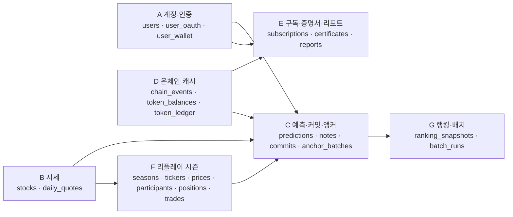
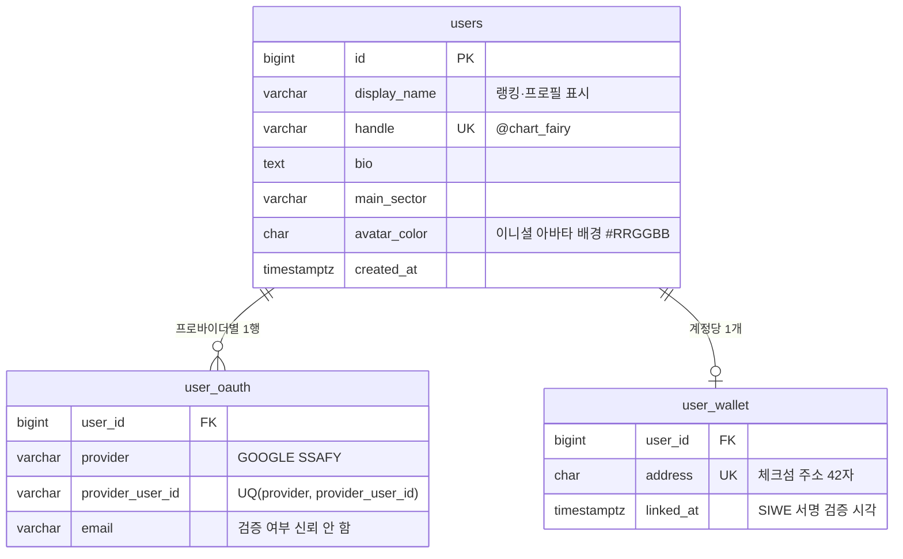
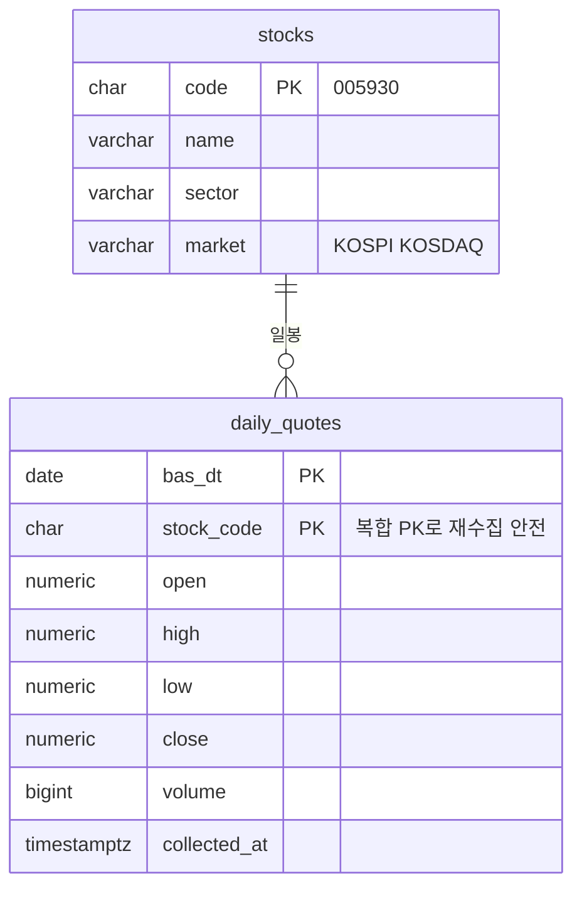
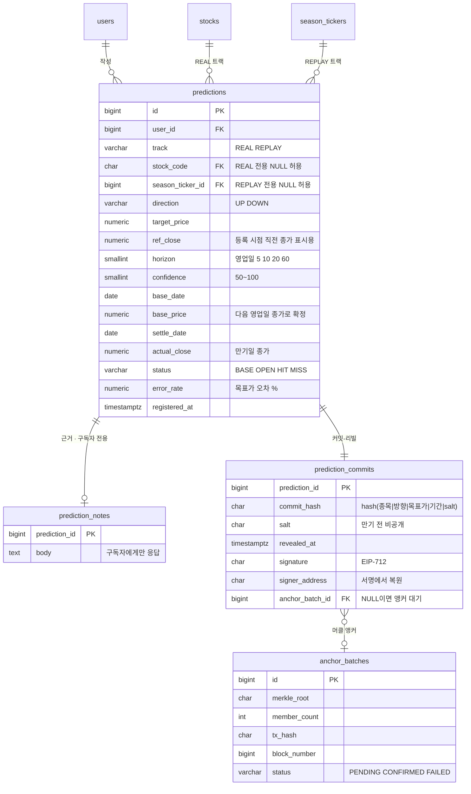
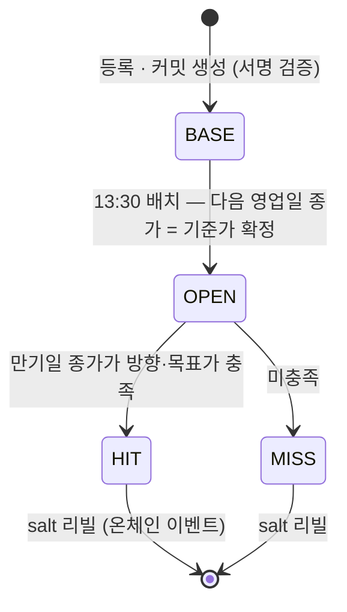
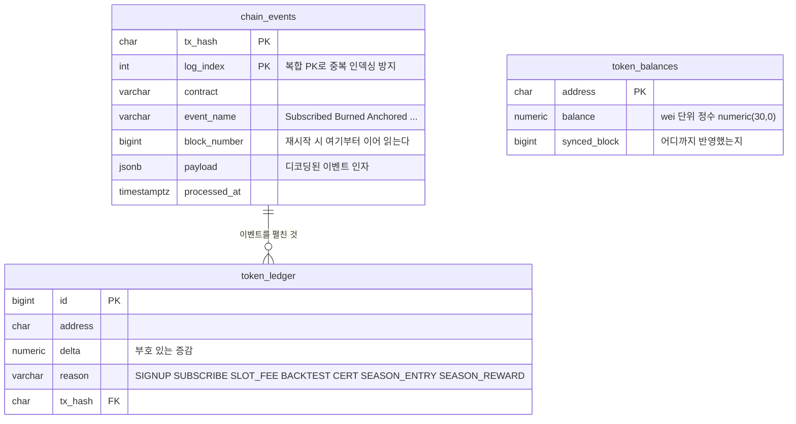
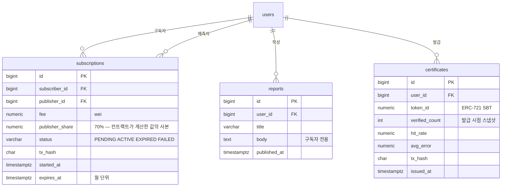
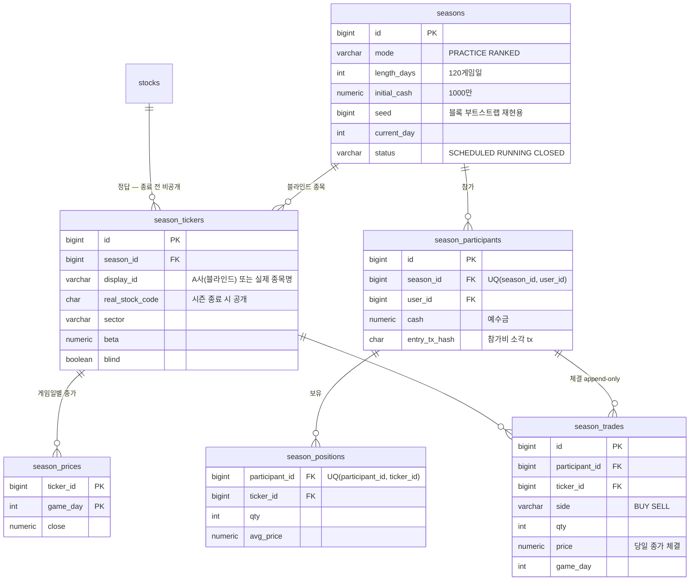
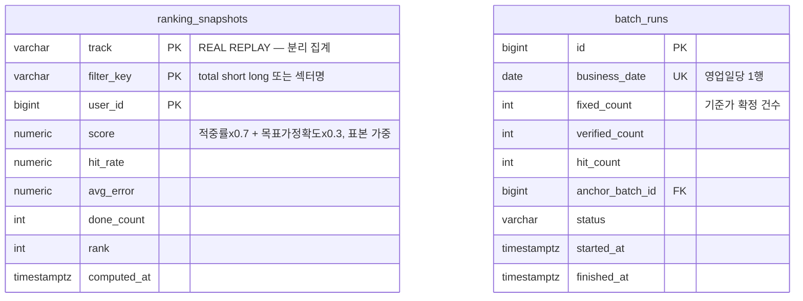

# 엔테나(Antenna) — ERD

작성 2026-08-24 · DB PostgreSQL 18 · 기준 문서 「엔테나 구현 기획서」 4장

팀 결정 반영: **월 구독 유지** · **팔로우/스타 미도입** · 지갑 **SSAFY WALLET**(MetaMask 기반) · 가스 토큰 SSAFY 지급

---

## 1. 설계 원칙

| # | 원칙 | 결과 |
|---|---|---|
| 1 | **예측은 생성·조회만** — 수정·삭제 없음 | `predictions`에 UPDATE는 배치의 상태 전이만 허용, DELETE 없음. 지울 수 있으면 서비스의 존재 이유가 사라진다 |
| 2 | **원장은 append-only** | `token_ledger`·`season_trades`·`chain_events`는 INSERT만 |
| 3 | **잔액의 진실은 온체인** | `token_balances`는 조회 속도용 캐시. 갱신 주체는 체인 인덱서 하나뿐 |
| 4 | **비밀은 테이블 분리** | salt·근거를 `predictions` 본체에서 분리(`prediction_commits`·`prediction_notes`) — 엔티티 통째 직렬화 사고로 새지 않게, 구독 게이팅 쿼리가 깔끔하게 |
| 5 | **다형 참조 금지** | 실전/리플레이 대상은 `stock_code` / `season_ticker_id` 두 nullable FK + CHECK. 둘 중 하나만 NOT NULL |
| 6 | **트랙 분리 집계** | `ranking_snapshots.track` — 합성 경로 실적이 실전 신뢰도를 오염시키면 안 된다 |
| 7 | **정밀 수치** | 가격은 `numeric(14,2)`, 토큰은 wei 단위 `numeric(30,0)`. `double` 금지 |

---

## 2. 도메인 맵



**의존 방향에서 읽을 것 둘.**
- `F 시즌`이 `C 예측`을 향한다 — 리플레이 시장 위에서도 예측을 등록·검증한다(MarketClock). 그래서 `predictions`가 시즌 종목을 참조하지 그 반대가 아니다.
- `D 온체인 캐시`에서 화살표가 **나간다** — `chain_events`가 모든 온체인 상태의 원천이고 나머지는 그 반영이다. 이 방향이 뒤집히면 설계가 무너진다.

---

## 3. A. 계정 · 인증



| 테이블 | 컬럼 | 타입 | 메모 |
|---|---|---|---|
| `users` | id | bigserial PK | 계정 본체. OAuth·지갑은 여기 붙는 인증 수단 |
| | display_name | varchar(40) | |
| | handle | varchar(30) UQ | 공개 식별자 |
| | bio · main_sector | text · varchar(20) | |
| | avatar_color | char(7) | |
| | created_at | timestamptz | |
| `user_oauth` | user_id | bigint FK | **이메일 자동 병합 금지, 명시적 연동만** — 프로바이더가 이메일을 검증했다는 보장이 없다 |
| | provider | varchar(16) | `GOOGLE` · `SSAFY` |
| | provider_user_id | varchar(128) | UNIQUE(provider, provider_user_id) |
| | email | varchar(255) | |
| `user_wallet` | user_id | bigint FK | 예측 등록 서명용. **SSAFY WALLET**(MetaMask 기반) 주소. 계정당 1개 |
| | address | char(42) UQ | |
| | linked_at | timestamptz | SIWE nonce 서명 검증 시각 |

refresh token은 여기에 없다 — **Redis에만**(회전·재사용 탐지·강제 로그아웃). access token은 어디에도 저장하지 않는다.

---

## 4. B. 시세



| 테이블 | 컬럼 | 타입 | 메모 |
|---|---|---|---|
| `stocks` | code | char(6) PK | 종목 마스터. 상장폐지는 행 유지(과거 예측이 참조) |
| | name · sector · market | varchar | 섹터가 랭킹 필터 키 |
| `daily_quotes` | (bas_dt, stock_code) | 복합 PK | **멱등 upsert의 핵심** — 날짜별 수집(`basDt` 1콜 = 그날 전 종목), 재수집이 안전 |
| | open · high · low · close | numeric(14,2) | `double` 금지 |
| | volume | bigint | |
| | collected_at | timestamptz | |

공휴일·거래정지는 데이터 없음이 정상. 만기 계산(영업일 5/10/20/60)은 `daily_quotes`의 distinct `bas_dt`가 곧 영업일 달력이므로 별도 달력 테이블 없이 시작한다 — 필요해지면 `trading_days` 파생 테이블 추가.

---

## 5. C. 예측 · 커밋 · 앵커



### 예측 상태 전이



**BASE와 만기 사이에서 예측 내용은 한 글자도 바뀔 수 없다.** 커밋 해시가 이미 온체인에 있으므로 목표가를 고치면 재계산한 해시가 어긋난다. 근거는 유료 비공개인데 조작 불가는 증명되는 구조 — 이것이 구독 모델의 전제다.

### 커밋 해시 정의

```
payload     = "{종목}|{방향}|{목표가}|{기간}"      예: "005930|UP|82000|20"
commit_hash = hash(payload | salt)                salt: 32자 hex, 만기 전 비공개
```

정규화 규칙(구분자 `|`, 목표가 표기 자리수)을 여기서 못 박는다 — 어긋나면 외부 검증이 전부 불일치로 뜬다. 리빌 후에는 `GET /api/ledger/verify/{id}`가 payload·salt·머클 증명·tx를 전부 내려 브라우저 재계산이 가능하다.

| 테이블 | 컬럼 | 타입 | 메모 |
|---|---|---|---|
| `predictions` | track | varchar(8) | `REAL` / `REPLAY` |
| | stock_code / season_ticker_id | char(6) / bigint | **둘 중 하나만 NOT NULL** (CHECK, 10장) |
| | direction | varchar(4) | `UP` / `DOWN` |
| | target_price · ref_close | numeric(14,2) | `ref_close`는 표시용 — **기준가가 아니다** |
| | horizon | smallint | 5 / 10 / 20 / 60 영업일 |
| | confidence | smallint | 50~100 |
| | base_date · base_price | date · numeric(14,2) | 등록 시 NULL, 배치가 확정 |
| | settle_date · actual_close | date · numeric(14,2) | 만기일과 그날 종가 |
| | status | varchar(8) | `BASE` → `OPEN` → `HIT`/`MISS` |
| | error_rate | numeric(6,3) | 목표가 오차 %. 신뢰도 입력값 |
| `prediction_notes` | body | text | 분리 이유: 구독 게이팅 쿼리가 깔끔해진다. 미구독 조회는 403 |
| `prediction_commits` | commit_hash | char(64) | |
| | salt | char(32) | **리빌 전 어떤 API 응답에도 실리지 않는다** |
| | signature · signer_address | char(132) · char(42) | EIP-712 작성자 부인방지. 서버가 서명에서 주소를 복원해 연동 지갑과 대조, 불일치면 401 |
| | anchor_batch_id | bigint FK NULL | NULL = 앵커 대기 |
| `anchor_batches` | merkle_root | char(64) | 앵커 1건 = 트랜잭션 1건 |
| | member_count | int | 포함 커밋 수 |
| | tx_hash · block_number | char(66) · bigint | 확정 후 채워진다 |
| | status | varchar(10) | `PENDING` → `CONFIRMED` / `FAILED`(다음 회차 재시도) |

---

## 6. D. 온체인 캐시 — chain_events · token_balances · token_ledger

서버는 릴레이어 + 인덱서다. 이 세 테이블이 그 인덱서의 저장소이며, **진실은 컨트랙트에 있다.**



| 테이블 | 역할 | 규칙 |
|---|---|---|
| `chain_events` | 모든 온체인 캐시의 **원천**. 재처리 가능해야 한다 | (tx_hash, log_index) 복합 PK. 인덱서 재시작 시 `max(block_number)`부터 이어 읽는다 |
| `token_balances` | 조회 속도용 캐시 | 갱신 주체는 인덱서 하나. 서버가 고쳐도 다음 인덱싱에서 되돌아온다 |
| `token_ledger` | 이벤트를 사람이 읽는 형태로 펼친 것 | append-only. reason 7종 — **환금·충전 reason은 존재하지 않는다** (규제 대응이 코드에 있는 지점) |

PRT는 **전송 불가 ERC-20**(`transfer`·`transferFrom`·`approve` revert)이므로 `Transfer` 일반 이벤트가 아니라 mint/burn/subscribe 계열 이벤트만 인덱싱 대상이다.

---

## 7. E. 구독 · 증명서 · 리포트



| 테이블 | 핵심 | 메모 |
|---|---|---|
| `subscriptions` | **결제가 즉시 완료가 아니므로 상태를 가진다** | `POST /api/subscriptions` → 202 + `PENDING`. 블록 확정 후 인덱서가 `ACTIVE`로 전환. 70:30 배분은 컨트랙트 `subscribe()`가 집행하고 여기 값은 사본. UNIQUE(subscriber_id, publisher_id, started_at) + 자기 구독 금지 CHECK |
| `reports` | 예측자의 분석 리포트 | 목록은 공개, 본문은 구독자만 |
| `certificates` | SBT 발급 기록 | 발급 시점 지표를 스냅샷으로 굳힌다 — 나중에 실적이 나빠져도 발급된 증명서는 그때의 사실을 말한다. 플랫폼이 망해도 지갑에 남는다 |

---

## 8. F. 리플레이 시즌 — 전부 오프체인

시즌 예수금은 PRT가 아닌 별도 가상 화폐이고 게임일마다 거래가 발생해 빈도가 높다 — 온체인에 올릴 이유가 없다. 참가비(1,000 PRT 소각)만 온체인.



### 시즌 2모드

| mode | 데이터 | 종목명 | 보상 | 용도 |
|---|---|---|---|---|
| `PRACTICE` | 순정 리플레이 — 실제 구간 그대로 | 공개 (`blind=false`) | 없음 | 학습 · **시연** |
| `RANKED` | 블록 부트스트랩 (`seed`, 20일 블록) | 익명 A사~ (`blind=true`) | 참가비 1,000 PRT → 상금 | 경쟁 |

```
실제 수익률 시계열 → 20일 블록 분할 → seed 로 셔플 → 누적곱으로 가격 복원
보존: 변동성 크기 · 급등락 빈도 · 모멘텀 · 변동성 클러스터링
소멸: 역사적 시점 (검색할 대상이 없어짐 — 커닝 차단)
```

- 부트스트랩은 **랭킹 시즌에만** — 연습 시즌은 실제 역사를 그대로 두는 편이 교육적.
- `season_prices`는 시즌 시작 시 seed로 일괄 생성 후 **읽기 전용** — 체결·손익·판정이 전부 이 가격에 매달리므로 재생성 로직이 바뀌어도 과거와 어긋나면 안 된다.
- `real_stock_code`는 `status=CLOSED` 전까지 API 응답 금지 — 블라인드가 뚫리면 부트스트랩의 의미가 없다.

---

## 9. G. 랭킹 · 배치



| 테이블 | 핵심 |
|---|---|
| `ranking_snapshots` | **배치에서만 갱신** → 캐시 무효화 시점이 배치 끝 하나뿐이라 Redis 설계가 자명하다. `track` 분리 — 합성 실적이 실전 점수를 오염시키면 안 된다. 신뢰도 = (적중률×0.7 + 목표가 정확도×0.3) × 표본 가중치 |
| `batch_runs` | 중복 실행 방지(`business_date` UNIQUE)와 시연 재현 |

---

## 10. 제약 · 인덱스 (DDL 발췌)

```sql
-- 실전/리플레이 대상 배타 (원칙 5)
ALTER TABLE predictions ADD CONSTRAINT ck_pred_target CHECK (
    (track = 'REAL'   AND stock_code IS NOT NULL AND season_ticker_id IS NULL)
 OR (track = 'REPLAY' AND stock_code IS NULL     AND season_ticker_id IS NOT NULL)
);
ALTER TABLE predictions ADD CONSTRAINT ck_pred_horizon  CHECK (horizon IN (5,10,20,60));
ALTER TABLE predictions ADD CONSTRAINT ck_pred_conf     CHECK (confidence BETWEEN 50 AND 100);

-- 시세 멱등 upsert (복합 PK가 곧 유니크 키)
-- daily_quotes: PRIMARY KEY (bas_dt, stock_code)

-- 검증 배치 스캔: 처리 대상만 부분 인덱스
CREATE INDEX ix_pred_base_due   ON predictions (base_date)   WHERE status = 'BASE';
CREATE INDEX ix_pred_settle_due ON predictions (settle_date) WHERE status = 'OPEN';

-- 피드 · 프로필
CREATE INDEX ix_pred_user  ON predictions (user_id, registered_at DESC);
CREATE INDEX ix_pred_feed  ON predictions (track, status, registered_at DESC);

-- 앵커 대기 커밋 스캔
CREATE INDEX ix_commit_unanchored ON prediction_commits (prediction_id)
    WHERE anchor_batch_id IS NULL;

-- 온체인 인덱서
-- chain_events: PRIMARY KEY (tx_hash, log_index)  ← 중복 인덱싱 방지
CREATE INDEX ix_events_cursor ON chain_events (block_number);

-- 구독
CREATE UNIQUE INDEX ux_subs ON subscriptions (subscriber_id, publisher_id, started_at);
ALTER TABLE subscriptions ADD CONSTRAINT ck_no_self_sub CHECK (subscriber_id <> publisher_id);
CREATE INDEX ix_subs_active ON subscriptions (subscriber_id, publisher_id)
    WHERE status = 'ACTIVE';

-- 시즌
CREATE UNIQUE INDEX ux_participant ON season_participants (season_id, user_id);
CREATE UNIQUE INDEX ux_position    ON season_positions (participant_id, ticker_id);

-- 랭킹
-- ranking_snapshots: PRIMARY KEY (track, filter_key, user_id)
CREATE INDEX ix_rank ON ranking_snapshots (track, filter_key, rank);
```

**append-only 강제**는 앱 규약만으로는 약하다. 운영 DB에서는 앱 계정의 권한을 회수한다:

```sql
REVOKE UPDATE, DELETE ON chain_events, token_ledger, season_trades FROM antenna_app;
-- predictions 는 배치의 상태 전이 UPDATE 만 필요하므로 컬럼 단위 GRANT 로 좁힌다
```

`ddl-auto: update`는 스키마 확정 시점(지금)에 Flyway `V1__init.sql` + `validate`로 전환한다 — 원장이 append-only인데 스키마가 자동 변형되면 재현 검증이 무너진다.

---

## 11. 전체 테이블 목록 (22)

| # | 테이블 | 도메인 | 성격 |
|---|---|---|---|
| 1 | `users` | A | 마스터 |
| 2 | `user_oauth` | A | 마스터 |
| 3 | `user_wallet` | A | 마스터 |
| 4 | `stocks` | B | 마스터 |
| 5 | `daily_quotes` | B | 시계열 (멱등 upsert) |
| 6 | `predictions` | C | 상태 전이만, DELETE 없음 |
| 7 | `prediction_notes` | C | 유료 콘텐츠 |
| 8 | `prediction_commits` | C | 커밋-리빌 |
| 9 | `anchor_batches` | C | 온체인 영수증 |
| 10 | `chain_events` | D | **append-only · 원천** |
| 11 | `token_balances` | D | 캐시 (진실은 컨트랙트) |
| 12 | `token_ledger` | D | **append-only** |
| 13 | `subscriptions` | E | 상태 (PENDING→ACTIVE) |
| 14 | `reports` | E | 유료 콘텐츠 |
| 15 | `certificates` | E | SBT 발급 기록 |
| 16 | `seasons` | F | 마스터 |
| 17 | `season_tickers` | F | 마스터 (블라인드) |
| 18 | `season_prices` | F | 시계열 (불변) |
| 19 | `season_participants` | F | 트랜잭션 |
| 20 | `season_positions` | F | 집계 |
| 21 | `season_trades` | F | **append-only** |
| 22 | `ranking_snapshots` · `batch_runs` | G | 배치 산출물 |

---

## 12. 프로토타입 타입과의 대응

프론트 `frontend/src/engine/types.ts`가 도메인을 이미 정의해 두었다. 서버 스키마와의 대응:

| 프로토타입 | 서버 | 차이 |
|---|---|---|
| `Pred.refClose` | `predictions.ref_close` | 동일. 표시용, 기준가 아님 |
| `Pred.entry` / `settle` | `base_price` / `actual_close` | "기준가"로 통일 — `entry`는 매수단가로 오해됨 |
| `Pred.day` / `baseDay` | `registered_at` + `base_date` | 프로토타입은 인덱스, 서버는 날짜 |
| `Pred.status: BASE/OPEN/HIT/MISS` | `predictions.status` | **동일 명칭** |
| `Pred.salt` / `commit` | `prediction_commits` | 테이블 분리 — 클라이언트도 별도 응답으로 |
| `Block` (자체 해시체인) | `chain_events` + `anchor_batches` | 프로토타입의 로컬 원장이 실물 온체인 + 인덱서로 대체 |
| `Tick` | `season_tickers` + `season_prices` + `season_positions` | 세 관심사 분리 |
| `Season.len` / `cash0` | `length_days` / `initial_cash` | |
| `Stats.rate` / `err` / `score` | `ranking_snapshots` | 서버 배치 산출로 이동 |

---

## 13. 확장 지점 · 미결정

| 항목 | 현재 스키마 | 결정되면 |
|---|---|---|
| 건당 근거 열람권 | 없음 (월 구독만) | `note_unlocks(user_id, prediction_id, tx_hash)` 한 테이블 추가로 끝 |
| 팔로우·스타 | 없음 | `user_follows` 한 테이블. **랭킹 점수 반영 절대 금지** — 인기투표 회귀 |
| 금칙어 필터 · 자격 배지 | 없음 | `prediction_notes` 저장 전 검사 + `users`에 배지 컬럼 |
| refresh 재사용 탐지 | Redis 정책 미정 | 재제출 시 계정 전체 폐기 여부 |
| AI 포트폴리오 (DART+RAG) | 없음 | `dart_documents` · `dart_chunks(embedding)` · `ai_reports(metrics jsonb, body)` 3테이블. **주의**: `postgres:18-alpine`엔 pgvector 없음 — 이미지 교체(`pgvector/pgvector:pg18`) 또는 외부 벡터스토어 |
| SeasonPrizePool | `season_participants.entry_tx_hash`만 | 컨트랙트 이벤트 인덱싱 추가 (스키마 변경 없음 — `chain_events`가 흡수) |

---

## 14. 문서 링크

- [기술 스택 · 아키텍처](01-tech-stack-architecture.md)
- [사용자 플로우](03-user-flow.md)
- [REST API 명세](04-rest-api.md)
