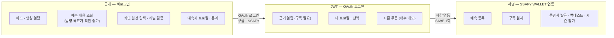
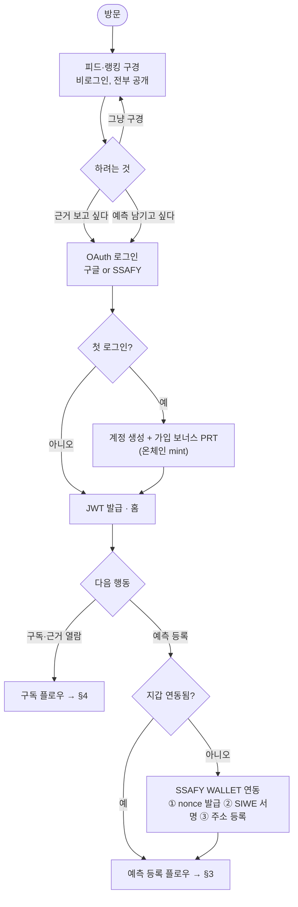
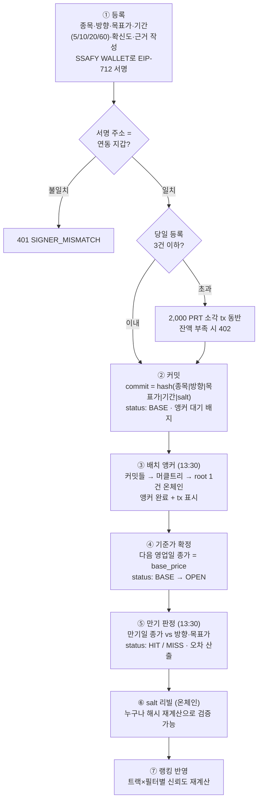
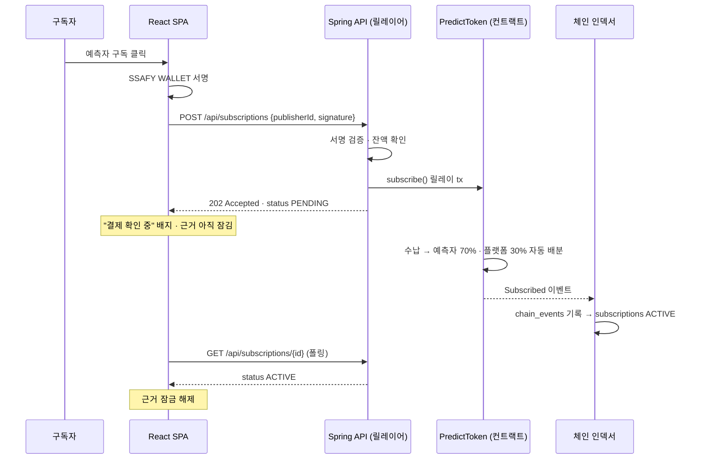
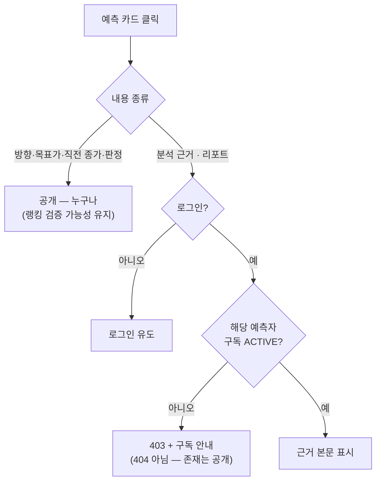
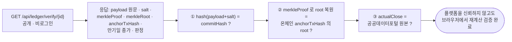
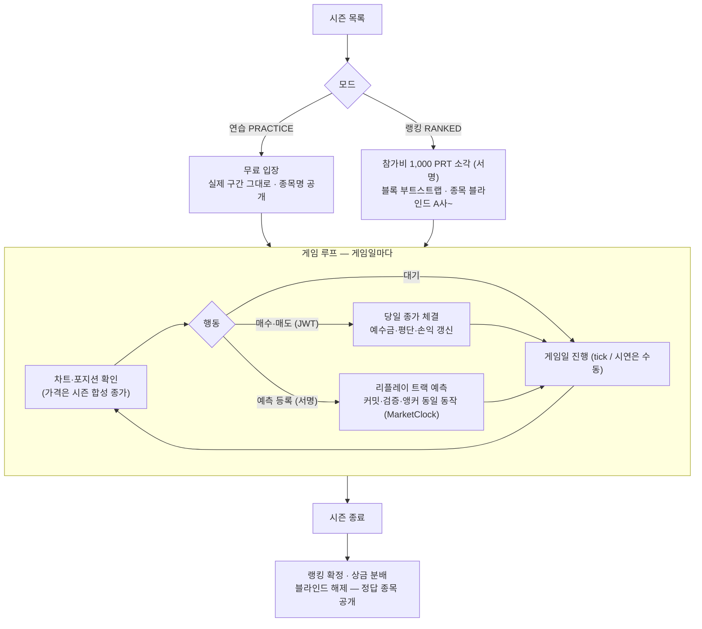
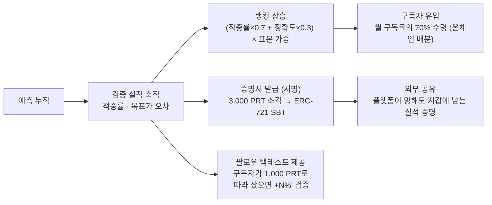

# 엔테나(Antenna) — 사용자 플로우

작성 2026-08-24 · 기준 문서 「엔테나 구현 기획서」 5장

읽기는 대부분 열려 있다. 로그인은 **토큰이 움직이는 곳과 구독 게이팅**에만 필요하고, 지갑(SSAFY WALLET)은 **예측 등록과 토큰 이동**에만 필요하다.

---

## 1. 인증 등급과 지갑 벽의 위치

**지갑 벽이 예측 등록(토큰 이동) 앞에만 서 있다.** OAuth를 도입한 이유가 온보딩 허들 완화이므로 로그인 직후 지갑을 요구하면 그 목적이 무너진다. 심사위원도 지갑 없이 시연 대부분을 볼 수 있어야 한다.

---

## 2. 온보딩

- 같은 사람이 구글·SSAFY 양쪽으로 로그인하면 계정이 둘로 갈린다 — **이메일 자동 병합은 하지 않고**, 로그인 상태에서의 명시적 계정 연동으로만 합친다.
- 지갑 연동은 1회. 이후 예측 등록마다 EIP-712 서명만 붙는다.

---

## 3. 예측 라이프사이클 (핵심 플로우)

**①과 ⑤ 사이에서 예측 내용은 한 글자도 바뀔 수 없다.** 커밋 해시가 이미 온체인에 있으므로 목표가를 고치면 재계산한 해시가 어긋난다. 근거는 유료 비공개인데 조작 불가는 증명된다 — 이것이 구독 모델의 전제다.

**등록 시점에 기준가를 정하지 않는 이유** — 장중 정보를 보고 등록하면서 기준가만 전일 종가면 하루치 정보 우위가 생긴다. 기준가는 ④에서 다음 영업일 종가로 확정된다.

---

## 4. 구독 결제 — 온체인이라 즉시 완료가 아니다

1~4는 즉시, 배분·확정은 블록 확정 후다. 그동안 구독은 `PENDING`이고 근거는 아직 잠겨 있다. 예측 커밋의 "앵커 대기 → 앵커 완료"와 같은 패턴이라 **화면 언어를 재사용**할 수 있다.

배분율 70:30은 컨트랙트가 집행한다 — 플랫폼이 몰래 바꿀 수 없고, 바꾸려면 온체인에 흔적이 남는다.

---

## 5. 구독자의 근거 열람

예측 내용은 **미구독자에게도 공개**한다 — 가려버리면 랭킹을 외부에서 검증할 수 없다. 잠기는 것은 근거·리포트뿐.

---

## 6. 제3자 검증 (커밋 원장 탐색기)

적중 판정 자체는 온체인으로 옮길 수 없다(종가 오라클 부재). 대신 **판정 입력값을 앵커에 함께 기록**해 누구나 사후 대조로 적발할 수 있다.

---

## 7. 리플레이 시즌

- 리플레이 예측도 실전과 **같은 로직**으로 커밋·검증·앵커된다 — 도메인 코드는 MarketClock만 보므로.
- 랭킹은 트랙 분리 집계 — 합성 데이터 실적이 실전 신뢰도를 오염시키지 않는다.

---

## 8. 예측자 성장 플로우 (구독 수익 · 증명서)

---

## 9. 시연 시나리오 (5분)

| 시각 | 장면 | 보여주는 것 |
|---|---|---|
| 0:00 | 리플레이 연습 시즌 진행 중 — Day 30/120 | MarketClock 위의 시장 |
| 0:30 | 예측자: 예측 등록 → 커밋 해시 즉시 표시, "앵커 대기" | 커밋-리빌 시작 |
| 1:00 | 구독자 계정 전환 → 구독 결제(PENDING→ACTIVE) → 근거 열람 | 온체인 결제 + 70:30 배분 |
| 1:30 | 시간 가속(게임일 진행) → 기준가 확정 → 만기 검증 → 적중 판정 | 전체 사이클 30초 재현 |
| 2:30 | 랭킹 갱신, 신뢰도 점수 변동 | 트랙 분리 집계 |
| 3:00 | 커밋 원장: 커밋 → 머클 앵커 → salt 공개 → 리빌 검증 | 제3자 검증 가능성 |
| 3:30 | 변조 시도 → 해시 불일치 + 머클루트 불일치 동시 탐지 | 조작 불가 증명 |
| **4:00** | **실전 트랙 전환 — 같은 화면·같은 로직, 시계만 실제 영업일** | **시연용이 아님을 증명** |
| 4:30 | 백테스트 실행 → 팔로우 수익률 리포트 | "따라 샀으면 +12.4%" |

4:00 지점의 전환이 핵심이다. 리플레이로 전체 흐름을 보인 뒤 실전 트랙을 비추면 시연용으로 만든 것이 아님이 증명된다.

---

## 10. 문서 링크

- [기술 스택 · 아키텍처](01-tech-stack-architecture.md)
- [ERD](02-erd.md)
- [REST API 명세](04-rest-api.md)
