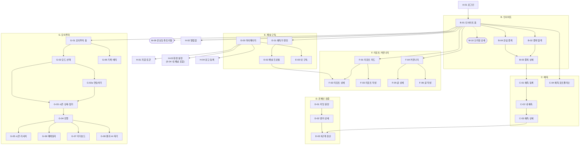

# 엔테나(Antenna) — 화면 설계서

작성 2026-08-28 · 갱신 2026-09-06(모의투자 G 영역) · 기준 [엔테나 API 명세서](앤테나_API_명세서.html) · [ERD v0.6](앤테나_ERD.html) · SSAFY 15기 S15P21A507

**42개 화면 · 10개 모달 · 9개 영역.** REST 93 + STOMP 1 = 94개 인터페이스가 모두 §8 역매핑 표에 배치된다.
> 2026-09-06 — 모의투자에 **G-02a 연습하기**를 더해 41 → 42가 됐다. 연습이 대회와 다른 흐름을 갖게 되면서 생긴 화면이며, 프로토타입 `screens/sim-practice.html`이 원본이다.
권한 등급 — <kbd>공개</kbd> 비로그인 / <kbd>JWT</kbd> 로그인 / <kbd>서명</kbd> 지갑 서명 동반.

---

## 1. 설계 전제

명세서 §1이 화면을 직접 구속하는 지점.

| # | 규칙 | 화면 영향 |
|:--:|---|---|
| 1 | 전 API `Authorization: Bearer` 필요 (예외 `POST /auth/login/{provider}` · `/auth/refresh`) | <kbd>공개</kbd> 화면은 **A-01 하나**. 비로그인 딥링크는 A-01로 보내고 로그인 후 원래 경로 복귀 |
| 2 | 실전 시세는 **전일 종가만** · `/stocks/{code}/prices`는 종가만 | "현재가" 라벨 금지 → `전일 종가` 또는 `종가 기준 YYYY.MM.DD`. 일중·분봉·호가 없음. OHLCV는 모의투자(G)에만 |
| 3 | 금액 상수(슬롯·참가비·보너스·보상표)는 **서버 상수 · API 미노출** | 응답에 담긴 `overCost` · `fee` · `entryFee`만 표시. 보상 규모는 정적 문구 |
| 4 | 온체인 동반 요청은 **202 + `operationId` 폴링**(3~5초) | 대상 4곳(C-01 슬롯 초과 · E-02 구독 · H-04 광고 · G-03 참가)이 **M-02 하나**를 공유. `PENDING` = "블록 확정 대기" |
| 5 | 예측·근거는 **수정/삭제 API 없음** · `Idempotency-Key` 필수 | 수정·삭제 버튼 없음. 되돌릴 수 없는 POST 8종은 확인 단계에서 UUID 발급, 재시도 시 동일 키 유지 |
| 6 | 커서 페이징 `?cursor=&size=` | 전 목록 "더 보기"/무한 스크롤. **페이지 번호 금지**. 예외는 랭킹 `?fromRank=`뿐 |
| 7 | 시각 KST ISO-8601 · `me`는 예약 식별자 | 배치 산출물(랭킹·브리핑·판정)은 산출 시각 표기. 본인 리소스는 `/me/…`, 닉네임 `me` 금지 |

---

## 2. 화면 맵

---

## 3. 화면 목록

### A. 인증 · 공통

| ID | 화면 | 라우트 | 권한 | 핵심 구성 | 주요 API |
|:--:|---|---|:--:|---|---|
| **A-01** | 로그인 | `/login` | 공개 | SSAFY · Google OAuth 버튼 2개. **자체 가입 폼 없음** — 인가 코드 수신 후 서버 전달 | `POST /auth/login/{provider}` |
| **A-03** | 통합 검색 | `/search?q=` | JWT | 종목 · 채널 · 리포트 3섹션, 타입별 상위 N건. 더 보기는 전용 목록(B-02 · E-01 · F-01)으로 | `GET /search` |
| **A-04** | 오류 · 빈 상태 | — | — | 404 · 409 충돌 · 429 레이트리밋 · 체인 장애 배너 · 403 게이팅 카드 | — |

### B. 인사이트

| ID | 화면 | 라우트 | 권한 | 핵심 구성 | 주요 API |
|:--:|---|---|:--:|---|---|
| **B-01** | 인사이트 홈 | `/` | JWT | 시장 Overview(지수 3종 + 미니차트) · AI 시장 브리핑 · 토큰 잔액 · 관심 종목 · 인기 예측가 · 내 예측 요약 · 활성 광고 | `GET /market/indices` · `/briefings?scope=MARKET` · `/wallet/balance` · `/watchlist` · `/rankings?track=REAL&limit=5` · `/predictions/me/portfolio` · `/ads/active` |
| **B-02** | 종목 탐색 | `/stocks` | JWT | 섹터 칩 · 시장/심리/PER 필터 · 정렬 · 커서 페이징 · **행별 UP/DOWN 집계 배지** · 관심 토글 | `GET /stocks` · `POST`·`DELETE /watchlist` |
| **B-03** | 종목 상세 | `/stocks/:code` | JWT | 요약 헤더 · 종가 차트 · AI 브리핑 · 문서 요약 카드 · 투자 포인트 3열 · 기업 개요 · 재무 · 밸류에이션 · 경쟁사 · 예측 심리 | `GET /stocks/{code}` · `/prices` · `/sentiment` · `/briefings` · `/documents` · `/points` · `/profile` · `/financials` · `/valuation` · `/peers` |
| **B-04** | 관심 종목 | `/watchlist` | JWT | 전일 종가 · 전일 대비 · 최근 30일 미니차트, 최근 담은 순 | `GET /watchlist` · `DELETE /watchlist/{stockCode}` |

### C. 예측

| ID | 화면 | 라우트 | 권한 | 핵심 구성 | 주요 API |
|:--:|---|---|:--:|---|---|
| **C-01** | 예측 등록 | `/predict?code=` | **서명** | 슬롯 잔여 · 방향 · 목표가 · 기간 · 근거 본문 · 근거 포인트 · 서명 · 커밋 미리보기 | `GET /predictions/slots` · `/stocks/{code}/points` · `/stocks/{code}/documents` · `POST /predictions` |
| **C-02** | 내 예측 | `/me/predictions` | JWT | 상태 필터 · 대기 건 D-day · 판정 건 결과·오차 · 커서 페이징 | `GET /predictions/me` |
| **C-03** | 예측 상세 | `/predictions/:id` | JWT | 목표·기준가·진행률 · 근거 본문(구독 게이팅) · 조작 불가 근거 · 검산 이동 | `GET /predictions/{id}` |
| **C-04** | 예측 포트폴리오 | `/me/portfolio` | JWT | 판정 완료 누적 성과 · 상태 분포 · 온체인 기록 상태 | `GET /predictions/me/portfolio` |

### D. 온체인 검증

| ID | 화면 | 라우트 | 권한 | 핵심 구성 | 주요 API |
|:--:|---|---|:--:|---|---|
| **D-01** | 커밋 원장 | `/ledger` | JWT | 앵커 배치 목록 — 머클루트 · 커밋 수 · 블록 번호 · `PENDING`/`CONFIRMED`/`FAILED` · 확정 시각 | `GET /anchors` |
| **D-02** | 앵커 배치 상세 | `/ledger/anchors/:id` | JWT | 트랜잭션 해시 · 확정 시각 · 포함 커밋 해시 목록 | `GET /anchors/{id}` |
| **D-03** | 3단계 검산 | `/ledger/verify/:predictionId` | JWT | 브라우저에서 3단계를 **실제로 실행**하고 각 단계 결과 표시 | `GET /predictions/{id}/proof` |

### E. 채널 · 구독

| ID | 화면 | 라우트 | 권한 | 핵심 구성 | 주요 API |
|:--:|---|---|:--:|---|---|
| **E-01** | 예측가 랭킹 | `/rankings` | JWT | **트랙 탭(REAL/REPLAY)** · 기간·섹터·시즌 필터 · 내 순위 · 산출 시각 · 순위 직행 | `GET /rankings` · `/rankings/me` |
| **E-02** | 채널 프로필 | `/channels/:userId` | JWT | 소개 · 관심 분야 · 실적 통계 · 외부 채널 · 구독료 · 내 구독 상태 · 예측 목록 · 리포트 목록 · 백테스트 | `GET /channels/{userId}` · `/predictions` · `/reports` · `/backtest` |
| **E-03** | 내 구독 | `/me/subscriptions` | JWT | 채널 · 상태(PENDING/ACTIVE/EXPIRED) · 만료일 · 자동 갱신 여부 · 갱신 해지 | `GET /subscriptions/me` · `DELETE /subscriptions/{id}/renewal` |
| **E-04** | 내 채널 설정 | `/settings` 안의 섹션 | JWT | 현재 구독료 + 변경 이력 · 구독료 변경. **H-03 환경 설정 안의 '내 채널' 섹션이다**(2026-09-07 변경) — 별도 화면이 아니다. 옛 경로 `/me/channel` 은 `/settings` 로 넘긴다 | `GET`·`PUT /me/channel/fee` |
| **E-05** | 마이페이지 | `/me` | JWT | 프로필 요약 · 내 예측/리포트/글/포트폴리오/구독/지갑/배지 진입점 | `GET /users/me` · `/users/me/badges` |

### F. 리포트 · 커뮤니티

| ID | 화면 | 라우트 | 권한 | 핵심 구성 | 주요 API |
|:--:|---|---|:--:|---|---|
| **F-01** | 리포트 피드 | `/reports` | JWT | 탭(전체/구독 중) · 섹터 칩 · 정렬 · **잠금 배지** · 커서 페이징 | `GET /reports` |
| **F-02** | 리포트 상세 | `/reports/:id` | JWT | 제목·작성자·발행일 · 본문 또는 **3줄 미리보기 + 구독 CTA** | `GET /reports/{id}` |
| **F-03** | 리포트 작성 | `/reports/new` | JWT | 제목 · 본문 · **공개 범위 선택** · 이미지 첨부 | `POST /uploads` · `POST /reports` |
| **F-04** | 커뮤니티 피드 | `/posts` | JWT | 글 본문 · 리포스팅 원본 카드 · 첨부 예측 카드 · 공감/댓글 수 · 커서 페이징 | `GET /posts` · `POST`·`DELETE /posts/{id}/like` |
| **F-05** | 글 상세 | `/posts/:id` | JWT | 본문 · 첨부 카드 · 공감 · **단층 댓글** · 댓글 좋아요 · 신고 | `GET /posts/{postId}` · `/comments` · `POST /posts/{id}/comments` · `POST`·`DELETE /comments/{id}/like` |
| **F-06** | 글 작성 | `/posts/new` | JWT | 본문 · 리포트 첨부 · 예측 첨부 · 이미지 최대 4장 | `POST /uploads` · `POST /posts` |

### G. 모의투자

모드 3종 — `PRACTICE`(개인 진행·이어하기) · `COMPETITION`(공용 09~18시, 1시간=1게임일) · `DEMO`(시연). 예수금 원장은 금융망이며 로컬은 화면 서빙용 캐시, 잔고는 일 1회 대사된다.

**연습과 대회는 "조건을 누가 정하는가"로 갈린다.** 연습은 사용자가 **성격**(급락 구간·실적 발표 구간 같은 것)과 섹터를 고르고 **시기는 서버가 골라 숨긴다**. 대회는 관리자가 만든 시즌에 전원 동일 조건으로 참가한다. 구조까지 같으면 연습이 대회의 축소판일 뿐이어서 존재 이유가 없다.

**시기를 공개하지 않는 이유** — 연도를 알면 그다음에 무슨 일이 있었는지 아는 상태로 시작하게 되어 예측이 아니라 복기가 된다. `seasons.base_date`는 서버 전용이며 어떤 응답에도 싣지 않는다(ERD v0.6).

**`DEMO`는 관리자에게만 노출한다.** 일반 사용자의 모드 선택에는 연습·대회 두 장만 나온다.

| ID | 화면 | 라우트 | 권한 | 핵심 구성 | 주요 API |
|:--:|---|---|:--:|---|---|
| **G-01** | 모의투자 홈 | `/sim` | JWT | 진행 중 시즌(이어하기) · 완료 기록 요약 · 시즌 목록 | `GET /seasons/me` · `/seasons` |
| **G-02** | 모드 선택 | `/sim/modes` | JWT | 연습 · 대회 2카드 + 모드별 차이 · 시연은 관리자만 3번째 카드 | `GET /seasons?mode=` |
| **G-02a** | 연습하기 | `/sim/practice` | JWT | 연습 허브 — 진행 중·완료 요약 · 이어서 할 연습 · 성격별 연습 주제 | `GET /seasons/me` · `/seasons?mode=PRACTICE` |
| **G-03** | 시즌 상세·참가 | `/sim/seasons/:id` | **서명**(대회) | 성격 · 섹터 · 기간 · 초기 예수금 · 종목 수 · 참가비 · 대회 시간표 · 참가 | `GET /seasons/{id}` · `POST /seasons/{id}/join` |
| **G-04** | 진행 | `/sim/:id/play` | JWT | 게임일 헤더 · OHLCV 차트 · 보유 현황 · 주문 · 뉴스 · 다음 영업일 진행 | `GET /seasons/{id}/me` · `/tickers` · `/tickers/{tickerId}/prices` · `/news` · `POST /orders` · `POST /advance` |
| **G-05** | 시즌 리서치 | `/sim/:id/research` | JWT | 게임일 뉴스·공시·IR·역사적 사건 · 경제지표 | `GET /seasons/{id}/news` · `/indicators` · `/tickers` |
| **G-06** | 매매일지 | `/sim/:id/trades` | JWT | 체결 내역 — 종목·방향 필터 · 실현손익 · 커서 페이징 | `GET /seasons/{id}/trades` |
| **G-07** | 리더보드 | `/sim/:id/leaderboard` | JWT | 수익률·점수 순위 + 내 순위·백분위 | `GET /seasons/{id}/leaderboard` |
| **G-08** | 결과·AI 복기 | `/sim/:id/result` | JWT | 최종 성과 지표 + AI 복기 리포트 + 포트폴리오 구성 | `GET /seasons/{id}/result/me` · `/seasons/{id}/me` |
| **G-09** | 기록·배지 | `/sim/history` | JWT | 완료 시즌 이력 · 필터·정렬 · 획득 배지 | `GET /seasons/history/me` · `/users/me/badges` |

### H. 지갑 · 알림 · 설정 · 광고

| ID | 화면 | 라우트 | 권한 | 핵심 구성 | 주요 API |
|:--:|---|---|:--:|---|---|
| **H-01** | 지갑·토큰 | `/me/wallet` | JWT | 연동 상태 · 잔액 + **대사 시각** · 획득/사용 내역(사유 필터) | `GET /wallet` · `/wallet/balance` · `/wallet/ledger` |
| **H-02** | 알림함 | `/notifications` | JWT | 미확인 뱃지 · 알림 목록 · 개별/전체 읽음 · 딥링크 | `GET /notifications` · `PATCH /notifications/{id}/read` · `/notifications/read-all` · STOMP `/user/queue/notifications` |
| **H-03** | 환경 설정 | `/settings` | JWT | 프로필 수정 · **내 채널(E-04 구독료)** · 알림 3종 on/off · 트레이딩 기본 뷰 · 로그아웃 | `GET`·`PUT /users/me/settings` · `PATCH /users/me` · `GET /users/nickname/availability` · `GET`·`PUT /me/channel/fee` · `POST /auth/logout` |
| **H-04** | 광고 등록 | `/ads/new` | **서명** | 배너 업로드(고정 비율) · 링크 · 기간 · 비용 안내 · 서명 | `POST /uploads` · `POST /ads` |

### I. 관리자

관리자 전용, 그 외 `403`.

| ID | 화면 | 라우트 | 핵심 구성 | 주요 API |
|:--:|---|---|---|---|
| **I-01** | 신고 처리 | `/admin/abuse-reports` | 상태 필터 · 신고 목록 · 승인/반려 · 글·댓글 블라인드 | `GET`·`PATCH /admin/abuse-reports` · `PATCH /admin/posts/{id}/status` · `/admin/comments/{id}/status` |
| **I-02** | 회원 제재 | `/admin/users` | 상태 전이(ACTIVE/SUSPENDED) · 사유 | `PATCH /admin/users/{userId}/status` |
| **I-03** | 시즌 운영 | `/admin/seasons` | 시즌 목록 · 생성(모드·기간·예수금·시드·시간표) · 상태 전이 | `GET`·`POST /admin/seasons` · `PATCH /admin/seasons/{id}` |

### M. 모달 · 오버레이

라우트를 주지 않는다 — 뒤 화면의 맥락이 유지돼야 한다.

| ID | 모달 | 호출 위치 | 권한 | API |
|:--:|---|---|:--:|---|
| **M-01** | 지갑 연동 (nonce → 서명) | M-09 · C-01 진입 시 | JWT | `POST /wallet/nonce` · `/wallet/link` |
| **M-02** | **온체인 처리 대기** (202 폴링) | C-01 · E-02 · G-03 · H-04 | — | `GET /operations/{operationId}` |
| **M-03** | 구독 결제 확인 | E-02 · F-02 잠금 · C-03 근거 잠금 | **서명** | — |
| **M-04** | 주문 확인 | G-04 | JWT | — |
| **M-05** | 게임일 진행 확인 | G-04 | JWT | — |
| **M-06** | 신고 | F-04 · F-05 · E-02 | JWT | `POST /abuse-reports` |
| **M-07** | 이미지 업로드 | F-03 · F-06 · H-04 | JWT | `POST /uploads` |
| **M-08** | 세션 만료 | 전역 401 | — | `POST /auth/refresh` |
| **M-09** | **온보딩 튜토리얼** | A-01 로그인 직후 `isNew=true` | JWT | `GET /users/nickname/availability` · `PATCH /users/me` · `GET /wallet` |
| **M-10** | AI 브리핑 상세 | B-01 브리핑 카드 · B-03 브리핑 탭 | JWT | `GET /briefings/{id}` |

---

## 4. 화면별 설계 제약

| 화면 | 제약 |
|:--:|---|
| **A-01** | 응답 `isNew`·`walletLinked`로 분기 — `true/false`→홈+M-09, `false/false`→홈(C-01 진입 시 M-01), `false/true`→홈. Refresh는 httpOnly 쿠키, 클라이언트가 저장·조작하지 않는다. 401 시 `/auth/refresh` **1회만** 재시도 — 재사용 탐지 시 토큰 전체 폐기 |
| **A-03** | 얕은 검색이다. 타입별 상위 N건만, **필터·정렬·페이징 없음** — 전용 목록의 책임 |
| **B-01** | `/market/indices`는 KOSPI·KOSDAQ·USDKRW **3종 고정**. `series[]`는 최근 N일 종가(기본 30) → 종가 단선만. 인기 예측가는 `track=REAL&limit=5`로 E-01과 같은 API 재사용 |
| **B-02** | 컨트롤은 API 파라미터가 전부다 — `sector` · `market` · `sentiment` · `perMin/perMax`(역전 시 400) · `hasOpenPrediction` · `watchedOnly` · `sort`(`PREDICTION_COUNT` 기본 · `UP_RATIO` · `DOWN_RATIO` · `CHANGE_RATE` · `PER`). 행별 집계가 응답에 있어 행마다 `/sentiment`를 부르지 않는다 |
| **B-03** | 블록별 원천이 다르다 — 헤더 `/stocks/{code}` · 차트 `/prices`(종가 단일) · 브리핑 `/briefings` · 문서 `/documents`(요약+원문 링크만, 본문 미저장) · 포인트 `/points` · 개요 `/profile` · 재무 `/financials` · 밸류 `/valuation` · 경쟁사 `/peers` · 심리 `/sentiment`. 선택한 `pointId`를 C-01로 인계하며 **별도 API가 없다** |
| **C-01** | `direction` UP/DOWN · `targetPrice` 등록 후 불변 · `horizon` **5/10/20/60 고정** · `note` ≤5000자 구독자 전용 · `evidencePointIds`는 B-03 인계. **`commitHash`는 서버 salt 결합이라 클라이언트 계산 불가** → `payload`+`noteHash`까지만 미리보기. 기준가는 **다음 영업일 종가**로 배치 B2 확정 → 등록 직후 `BASE`, 빈 값을 0으로 그리지 않는다. 201 슬롯 내 / 202 초과→M-02 / 401 서명 불일치 / 409 잔액 부족 |
| **C-02** | 응답은 `id`·`stockCode`·`direction`·`targetPrice`·`horizon`·`status`·`dday`·`errorRate`·`settleDate`. 수정·삭제 버튼 없음 |
| **C-03** | 판정 완료는 전체 공개 / 미판정은 작성자·구독자만(403). **근거 본문은 항상 구독자 전용** — 만기 리빌 후에도 공개되지 않는다(payload에 `noteHash`만 들어감). 커밋 해시·앵커·서명 주소는 항상 공개 |
| **D-03** | ① `hash(payload\|salt)==commitHash` ② `merkleProof`로 root 복원 → 온체인 대조 ③ `settlePrice` ↔ 공공데이터 `sourceUrl`. **전부 클라이언트 실행** — 서버가 "검증됨"이라 말해주면 증명이 아니다. 만기 전에는 `salt`·판정이 null이라 ①③ 잠그고 ②만 |
| **E-01** | 트랙 분리는 타협하지 않는다 — 두 트랙 지표를 같은 표에 섞지 않는다. `tier`는 **REPLAY 전용**, 실전 프로필에 노출 금지. 배치 B3 스냅샷이라 `computedAt` 필수. `score` 산식은 미확정이라 값만 표시 |
| **E-02** | 구독은 즉시 토글이 아니다 — M-03 확인 → 서명 → 202 → M-02 → ACTIVE. 최초 구독 서명에 **오퍼레이터 위임 승인**(`operatorAuthorize`) 포함, 모달에서 고지. 결제 시점 `fee` 박제. 백테스트는 **무료·파라미터 고정**(3개월·상수 원금·수수료 0). 미판정 예측은 구독자에게만 응답에 포함 |
| **E-03** | `DELETE .../renewal`은 구독이 아니라 **갱신 예약**을 지운다 → 라벨 "자동 갱신 해지", 만료일까지 이용 가능 병기 |
| **E-04** | 변경은 **차기 주기부터**. 기존 구독은 만료까지 옛 가격. 변경 시 구독자 전원 알림(`FEE_CHANGED`). H-03 안의 섹션이라 진입점은 마이페이지 `설정` 하나다 |
| **F-01** | `scope` ALL/SUBSCRIBED · `sector` · `sort` RECENT/POPULAR. `locked`로 잠금 배지 — 제목·작성자·섹터·통계는 항상 공개(구독 유인) |
| **F-02** | `visibility=false` + 미구독 → `{ preview, locked }`. **404가 아니라 200+잠금** — 없는 것처럼 보이면 구독 유인이 사라진다 |
| **F-03** | 본문은 `title`·`body`·**`visibility` 필수**. 두 선택지를 반드시 노출. 이미지는 `fileId`만(외부 URL 금지) |
| **F-04 · F-05** | 첨부 3종 고정 — `reportId`(잠금은 원본 판정) · `predictionId`(공개 규칙 적용) · `imageFileIds`(≤4). **대댓글 없음** — 답글·스레드 UI 금지 |
| **G-02** | 모드 차이 중 사용자가 실제로 체감하는 것은 **"진행을 내가 하는가"와 "참가비가 있는가"** 둘이다 — 두 카드의 같은 자리에서 반대 값이 보이게 놓는다. 참가비는 **비용(소각)**이라 "소각"으로 쓰고 상금처럼 읽히는 문구를 쓰지 않는다. 시즌 난이도·연습 코스·주간 목표·연속 학습은 두지 않는다(`seasons`에 난이도가 없고 PRACTICE는 모드의 하나일 뿐) |
| **G-02a** | 설계서 §3에 없던 화면을 추가한 것이다 — G-02에서 연습을 고른 사람이 머무는 허브. 연습 주제는 `seasons.title`·`note`·`theme`에서 오며 **화면에 하드코딩하지 않는다**. 대회·시연 시즌은 이 목록에 섞지 않는다(`?mode=PRACTICE`) |
| **G-03** | PRACTICE·DEMO 즉시 `201` / COMPETITION은 **참가비 소각 서명** → `202` → M-02. 참가비는 **비용(소각)**이지 보상이 아니다. **재도전은 모드마다 다르다** — 연습·시연은 회차(`attempt_no`)를 늘려 **여러 번 다시 할 수 있고**, 대회는 `attempt_no=1` 고정으로 시즌당 한 번뿐이다. 유니크는 `(season_id, user_id, attempt_no)` 세 컬럼이라 스키마가 회차를 허용하고, 대회의 1회 제한은 앱이 지킨다. 결과·거래·포지션은 모두 시즌이 아니라 **회차(`participantId`)에 귀속**되므로 응답에도 어느 회차인지 실어야 한다. **시기를 그리지 않는다** — 성격(`title`)·섹터(상위 분류)·기간·예수금·종목 수까지만 보여주고 실제 날짜와 연도는 어떤 형태로도 표시하지 않는다. 진행 중인 회차가 있으면 참가 버튼이 **이어서 하기**로 바뀐다 |
| **G-04** | 주문 본문은 `tickerId`·`side`·`qty` 셋 — **게임일 종가 단일가 체결**, 유형·수수료·예약·손절 없음. `/tickers`는 `displayName`만(실명·실제 날짜·언론사 금지). 진행일 초과분 응답 금지. 보조지표는 프론트 계산. 진행은 `expectedDay` 낙관적 잠금(불일치 409), COMPETITION은 수동 진행 불가. 캔들은 `season_prices`의 `open`·`high`·`low`·`close`·`volume`으로 그린다(ERD v0.6에서 추가). 원천에 없는 값은 `null`로 오므로 거래량 막대는 빠질 수 있다 |
| **G-05** | **연습 1차 범위에서 경제지표를 내보내지 않는다.** 지표 절대값(코스피 1457 등) 하나로 구간이 특정되어 뉴스 익명화가 무의미해진다 — 넣으려면 시즌 시작 = 100 기준 상대값으로 바꾼다. 화면에서 숨기는 것으로는 부족하고 **응답에서 빼야** 한다(개발자도구로 다 보인다) |
| **G-06** | `/seasons/{id}/me`는 **현재 보유 현황**이지 매매 이력이 아니다 — 복기가 개별 체결을 짚어야 해서 별도 화면 |
| **G-08** | 응답 항목만 그린다. **AI 복기는 CLOSED 시 배치 B6 생성** → 생성 전 `null`이면 "생성 중", 온디맨드 버튼 없음. 등급 산식 미확정. 블라인드 해제는 CLOSED 이후 |
| **H-01** | 잔액 원천은 **온체인**, DB는 캐시 → `syncedAt` 병기. `reason` 7종만. 보너스·보상은 서버/배치 지급이라 **수령 버튼 없음** |
| **H-02** | STOMP는 REST와 동일 레코드 → **뱃지 +1만**, 목록은 REST로 동기화. `type` 6종을 `linkPath`로 딥링크 — `VERDICT`→C-03 · `SEASON`→G-08 · `SUBSCRIBE`·`FEE_CHANGED`→E-02 · `RENEW_FAILED`→E-03 · `REPORT_PUBLISHED`→F-02 |
| **H-03** | 설정은 `notifyVerdict`·`notifySeason`·`notifySocial`·`chartView` **4개뿐**. `interests`·`channels`는 배열 전체 교체, 채널 URL은 https만 |
| **H-04** | `imageFileId`는 업로드 응답만(외부 URL 불가) · `linkUrl` https만 · 202 → M-02. 관리자 사전 승인은 2차 |
| **I-01** | ACCEPT 시 대상은 `BLOCKED`로 **전환**되며 행이 삭제되지 않는다 — 문구를 "삭제"로 쓰지 않는다 |
| **I-03** | 시즌 가격은 생성 시 시드로 일괄 생성 후 **읽기 전용**. `SCHEDULED→RUNNING→CLOSED` 단방향, CLOSED가 결과 확정·복기 생성·블라인드 해제를 트리거 |
| **M-02** | 202를 쓰는 4곳이 **폴링 코드 1개·실패 스키마 1개**를 공유. `kind` 4종으로 문구 분기. `SUCCEEDED` 시 `resource`로 이동, 종료 상태는 24h 후 `404`. 체인 장애는 이 모달 안에서만 표현 |
| **M-06** | `targetType` 셋 중 정확히 하나 · 자기 신고 400. 블라인드는 관리자 수동이라 **즉시 가려지는 것처럼 표현하지 않는다** |
| **M-09** | 라우트를 주면 히스토리에 남아 이탈 시 복귀가 어렵다 → 홈 위 오버레이. `isNew`는 **최초 1회뿐**이라 건너뛰면 다시 뜨지 않는다(H-03에서 보완 안내). **M-01을 이 팝업 안에서 열지 않는다** — 모달 3겹 방지, 닫은 뒤 띄운다 |
| **M-10** | 라우트가 없어 **공유 링크가 없다**. 딥링크가 필요하면 `?briefing={id}` 쿼리로만 열고 닫을 때 제거 — 라우트를 만들지 않는다 |

---

## 5. 게이팅 규칙

| 대상 | 조건 | 응답 | 화면 |
|---|---|:--:|---|
| 미판정 예측(BASE/OPEN) | 작성자·구독자 외 | `403` | 잠금 카드 + 구독 CTA. **존재 자체는 공개** |
| 예측 근거 본문 | 미구독 | `403` | 잠금 카드. 커밋 해시·앵커는 그대로 노출 |
| 리포트 본문 | `visibility=false` & 미구독 | `200` + `{preview, locked}` | 3줄 미리보기 + 페이드 + 구독 CTA |
| 관리자 API | 비관리자 | `403` | 진입 자체를 막는다 |
| 타인 작업 조회 | 본인 아님 | `403` | M-02에서만 발생 |

**404가 아니라 403·잠금이다.** 없는 것처럼 보이면 구독 유인이 사라진다. 미판정 예측도 익명 집계(`/sentiment`)는 공개된다.

---

## 6. 오류 → 화면 처리

| 코드 | 의미 | 화면 |
|:--:|---|---|
| `400` | 검증 실패(`perMin>perMax` · `sort` · `horizon` 범위 · 자기 신고 · 업로드 규격) | 입력 필드 인라인 오류 |
| `401` | 인증 실패 · **서명 주소 불일치** | 인증은 M-08 / 서명 불일치는 연동 지갑 안내 후 재서명 |
| `403` | 권한 없음(미구독 근거 · 비공개 예측 · 관리자 · 타인 작업) | §5 잠금 카드 |
| `404` | 리소스 없음 · 작업 만료 | 빈 상태 |
| `409` | 충돌(중복 지갑 · 잔액/예수금 부족 · 중복 참가 · 대회 수동 진행 · `DAY_MISMATCH` · `IDEMPOTENCY_KEY_REUSED`) | 사유별 안내. `DAY_MISMATCH`는 화면 동기화 후 재시도 |
| `429` | 레이트리밋(대상·한도 미정) | 잠시 후 재시도 |

본문은 `{ code, message, status }`. **`code`로 분기하고 `message`를 그대로 노출하지 않는다.** `400 IDEMPOTENCY_KEY_REQUIRED`는 클라이언트 결함이라 사용자에게 노출하지 않고 키 발급 후 재요청.

---

## 7. 공통 컴포넌트

| 컴포넌트 | 사용처 | 비고 |
|---|---|---|
| `PriceLabel` | B-01~B-04 · C-01 · C-03 | **전일 종가 전용** — 기준일 병기, 현재가 표현 원천 차단 |
| `SentimentBadge` | B-02 · B-03 | `upRatio`/`downRatio` + 표본 수. 표본 적으면 흐리게 |
| `PredictionCard` | C-02 · C-03 · E-02 · F-04 | **잠금 상태 내장** — 게이팅 분기를 화면마다 쓰지 않는다 |
| `AnchorBadge` | C-01 · C-02 · D-01 · M-02 | 앵커 대기/확정/실패. **구독 PENDING도 같은 컴포넌트** |
| `OperationPoller` | M-02 | 202 → `GET /operations/{id}` 폴링 단일 훅 |
| `SubscriptionGate` | C-03 · E-02 · F-02 | 403 또는 `locked`를 받아 구독 CTA로 전환 |
| `CursorList` | 모든 목록 | `{ items, nextCursor, hasNext }` 계약 하나로 통일 |
| `SnapshotStamp` | E-01 · B-01 · B-03 | 배치 산출물의 `computedAt`/기준 영업일 |
| `CloseChart` | B-01 · B-03 · B-04 | **종가 단선 전용.** OHLC 입력을 받지 않는다 |
| `CandleChart` | G-04 · G-05 | 모의투자 전용 OHLCV. **절단 지점(진행일) prop 필수** |
| `TickerLabel` | G-04 · G-05 · G-06 | `displayName`만. 실명 필드를 받지 않는 타입으로 강제 |
| `SignConfirm` | C-01 · E-02 · G-03 · H-04 | 서명 대상 payload를 펼쳐 보여주는 확인 단계 |

---

## 8. API → 화면 역매핑

REST 93 + STOMP 1 = 94개가 모두 배치된다.

### 비동기 · 인증 · 회원

| 엔드포인트 | 화면 |
|---|---|
| `GET /operations/{operationId}` | M-02 |
| `POST /auth/login/{provider}` | A-01 |
| `POST /auth/refresh` | M-08 (전역) |
| `POST /auth/logout` | H-03 |
| `GET /users/me` | E-05 · M-09 |
| `PATCH /users/me` | M-09 · H-03 |
| `GET /users/nickname/availability` | M-09 · H-03 |
| `GET /users/me/settings` | H-03 |
| `PUT /users/me/settings` | H-03 |

### 지갑 · 토큰

| 엔드포인트 | 화면 |
|---|---|
| `POST /wallet/nonce` | M-01 |
| `POST /wallet/link` | M-01 |
| `GET /wallet` | H-01 · M-09 |
| `GET /wallet/balance` | H-01 · B-01 |
| `GET /wallet/ledger` | H-01 |

### 홈 · 시세

| 엔드포인트 | 화면 |
|---|---|
| `GET /market/indices` | B-01 |
| `GET /search` | A-03 |
| `GET /stocks` | B-02 |
| `GET /stocks/{code}` | B-03 |
| `GET /stocks/{code}/prices` | B-03 |
| `GET /watchlist` | B-04 · B-01 |
| `POST /watchlist` | B-02 · B-03 · B-04 |
| `DELETE /watchlist/{stockCode}` | B-02 · B-03 · B-04 |

### 리서치 · AI

| 엔드포인트 | 화면 |
|---|---|
| `GET /briefings` | B-01 · B-03 |
| `GET /briefings/{id}` | M-10 |
| `GET /stocks/{code}/documents` | B-03 · C-01 |
| `GET /stocks/{code}/points` | B-03 · C-01 |
| `GET /stocks/{code}/profile` | B-03 |
| `GET /stocks/{code}/financials` | B-03 |
| `GET /stocks/{code}/valuation` | B-03 |
| `GET /stocks/{code}/peers` | B-03 |

### 예측 · 온체인 검증

| 엔드포인트 | 화면 |
|---|---|
| `GET /predictions/slots` | C-01 |
| `POST /predictions` | C-01 |
| `GET /predictions/me` | C-02 |
| `GET /predictions/{id}` | C-03 |
| `GET /predictions/me/portfolio` | C-04 · B-01 |
| `GET /stocks/{code}/sentiment` | B-02 · B-03 |
| `GET /anchors` | D-01 |
| `GET /anchors/{id}` | D-02 |
| `GET /predictions/{id}/proof` | D-03 |

### 채널 · 구독

| 엔드포인트 | 화면 |
|---|---|
| `GET /channels/{userId}` | E-02 |
| `GET /channels/{userId}/predictions` | E-02 |
| `GET /channels/{userId}/backtest` | E-02 |
| `POST /channels/{userId}/subscriptions` | M-03 → M-02 |
| `DELETE /subscriptions/{id}/renewal` | E-03 |
| `GET /subscriptions/me` | E-03 |
| `GET /me/channel/fee` | E-04 |
| `PUT /me/channel/fee` | E-04 |

### 리포트 · 글 · 첨부 · 광고

| 엔드포인트 | 화면 |
|---|---|
| `POST /reports` | F-03 |
| `GET /reports` | F-01 |
| `GET /channels/{userId}/reports` | E-02 |
| `GET /reports/{id}` | F-02 |
| `GET /posts` | F-04 |
| `POST /posts` | F-06 |
| `GET /posts/{postId}` | F-05 |
| `POST /posts/{postId}/like` | F-04 · F-05 |
| `DELETE /posts/{postId}/like` | F-04 · F-05 |
| `GET /posts/{postId}/comments` | F-05 |
| `POST /posts/{postId}/comments` | F-05 |
| `POST /comments/{commentId}/like` | F-05 |
| `DELETE /comments/{commentId}/like` | F-05 |
| `POST /abuse-reports` | M-06 |
| `POST /uploads` | M-07 |
| `POST /ads` | H-04 |
| `GET /ads/active` | B-01 |

### 모의투자 · 랭킹

| 엔드포인트 | 화면 |
|---|---|
| `GET /seasons` | G-01 · G-02 |
| `GET /seasons/{id}` | G-03 |
| `POST /seasons/{id}/join` | G-03 → M-02 |
| `GET /seasons/me` | G-01 |
| `GET /seasons/{id}/me` | G-04 · G-08 |
| `POST /seasons/{id}/orders` | G-04 (M-04) |
| `GET /seasons/{id}/trades` | G-06 |
| `POST /seasons/{id}/advance` | G-04 (M-05) |
| `GET /seasons/{id}/tickers` | G-04 · G-05 |
| `GET /seasons/{id}/tickers/{tickerId}/prices` | G-04 |
| `GET /seasons/{id}/news` | G-04 · G-05 |
| `GET /seasons/{id}/indicators` | G-05 |
| `GET /seasons/{id}/leaderboard` | G-07 |
| `GET /seasons/history/me` | G-09 |
| `GET /seasons/{id}/result/me` | G-08 |
| `GET /users/me/badges` | G-09 · E-05 |
| `GET /rankings` | E-01 · B-01 |
| `GET /rankings/me` | E-01 |

### 알림 · 관리자 · 실시간

| 엔드포인트 | 화면 |
|---|---|
| `GET /notifications` | H-02 |
| `PATCH /notifications/{id}/read` | H-02 |
| `PATCH /notifications/read-all` | H-02 |
| `GET /admin/abuse-reports` | I-01 |
| `PATCH /admin/abuse-reports/{id}` | I-01 |
| `PATCH /admin/posts/{postId}/status` | I-01 |
| `PATCH /admin/comments/{commentId}/status` | I-01 |
| `PATCH /admin/users/{userId}/status` | I-02 |
| `GET /admin/seasons` | I-03 |
| `POST /admin/seasons` | I-03 |
| `PATCH /admin/seasons/{id}` | I-03 |
| `/user/queue/notifications` (STOMP) | H-02 (전역 뱃지) |

---

## 9. 설계에서 제외한 것

와이어프레임 검토에서 나온 불일치를 **전부 명세서 기준으로 결정**한 결과다.

### 9.1 도메인을 두지 않는다

| 제외 | 명세서 근거 |
|---|---|
| 무료 팔로우 · 팔로워 수 | 채널 관계는 유료 구독뿐 |
| 신뢰도 점수 | `stats`는 `hitRate`·`doneCount`·`avgError` 3개. 랭킹 `score`가 그 역할 |
| 확신도 | 예측 본문·커밋 payload 어디에도 없다 |
| 유저 레벨(Lv.) | 사용자 등급 필드가 없다. 배지와 랭킹 티어(REPLAY 전용)뿐 |
| 친구 | 도메인 없음 |
| 리포트 · 예측가 찜 | `/watchlist`는 `stockCode` 전용. 북마크 도메인 없음 |
| 글 카테고리 · 태그 · 조회수 | `POST /posts`는 4필드, `GET /posts`는 `cursor`·`size`만 |
| 임시 저장(초안) | DRAFT 상태도 수정·삭제 API도 없다 |
| 대댓글 | 명세서 명시 |
| 토큰 충전 · 구매 | 유입은 가입 보너스·성과 보상 mint뿐 |
| 시즌 난이도 | 시즌 속성에 difficulty 없음 |
| 연습 코스 · 주간 목표 · 연속 학습 | PRACTICE는 시즌 모드의 하나일 뿐 |
| 온디맨드 AI 힌트 · 복기 생성 | AI 생성은 전부 배치(B6) |
| 대회 사전 신청 | `POST /seasons/{id}/join`만 존재 |
| 검증 증명서(SBT) | 93개 엔드포인트에 도메인 없음 |
| 대회 재도전 | 대회만 시즌당 1회(attempt_no=1 고정) · 연습·시연은 회차를 늘려 여러 번 다시 할 수 있다 |

### 9.2 화면에 두지 않는 요소

| 화면 | 제외 | 근거 |
|:--:|---|---|
| B-01 | 관심 종목 1D 차트 · 토큰 기간 집계 · KRW 환산 · 대회 참가자 수 · 예측가 스폰서 카드 | `series`는 일 종가 · `/wallet/balance` 3필드 · `/seasons`에 참가자 수 없음 · `/ads/active`는 배너뿐 |
| B-02 | PBR 컬럼 · 종목명/종가 정렬 · 섹터 요약 바 · 페이지 번호 | items에 `pbr` 없음 · `sort` 5종 고정 · 섹터 집계 API 없음 · 커서 페이징 |
| B-03 | 시가총액 · EPS · 배당수익률 · 52주 범위 · 업종 평균 PER/PBR · 컨센서스 · 기업 캘린더 | `/stocks/{code}`+`/valuation`에 없음. `/peers`는 나열이지 평균이 아님. 컨센서스는 2차 범위 |
| B-04 | 행별 예측 심리 배지 | 응답에 집계 없음. 심리는 B-02·B-03에서만 |
| C-01 | 임의 마감일 · `commitHash` 선계산 · 리포트/재무지표를 근거로 선택 | horizon 4지 고정 · salt 서버 보관 · `evidencePointIds`는 포인트 ID만 |
| C-04 | AI 유형 분석문 · 섹터별·기간별 적중률 · 근거 사용 패턴 · 확신도 캘리브레이션 · 대표 Forecast · 공유 카드 · 누적 수익률 · 120영업일 | 응답 8필드뿐. horizon은 5·10·20·60 |
| E-01 | 실전 화면의 리플레이 티어 | `tier`는 REPLAY 전용 |
| E-02 · E-05 | 핸들(@) · 구독자 수 · 작성 카운트 | `/users/me`에도 `/channels/{userId}`에도 없음 |
| F-01 | 내가 쓴 리포트 탭 · 적중률 정렬 · 검증/공개/최소 적중률 필터 · 찜 · 댓글 수 · 근거 검증 배지 | `scope` 2종뿐, 응답에 `viewCount`만 |
| F-03 | 분야 · 한 줄 요약 입력 | 본문은 `title`·`body`·`visibility` |
| F-04 · F-05 | 내가 쓴 글 탭 · 언급 종목 카드 · 북마크 · 수정·삭제 | `GET /posts`는 `cursor`·`size`만 · 첨부 3종 고정 · 수정·삭제 API 없음 |
| G-01 | 완료 시즌 집계 통계 · 추천/인기 시즌 | `/seasons/history/me`는 목록만 |
| G-04 | 달력 날짜 · 전일 대비 · 시즌 종목 관심 담기 · 지표 기반 AI 힌트 | `prices`는 `gameDay`만 · `/me`에 전일 대비 없음 · 관심종목은 실전 전용 · AI 힌트는 `/news` 사건 요약 |
| G-07 | 연승 · 경기 수 · 레벨 · 기간별 수익률 추이 | leaderboard 4필드. "경기 수"는 1회 참가 모델과 불일치 |
| G-08 | 최종 순위 · 백분위 | `result/me`에 없음. 순위는 G-07·E-01 |
| G-09 | 배지 레벨 · 미획득(잠김) 배지 · 벤치마크 시계열 | `/badges`는 획득분만 |
| H-01 | 충전 버튼 · 보상 수령 버튼 | 토큰 구매 경로 없음 · 보너스는 서버/배치 지급 |
| H-03 | AI 힌트 토글 · 난이도 설정 | 설정은 알림 3종 + `chartView` |

> **9.1·9.2에 없는 요소를 새로 넣을 때는 대응 엔드포인트부터 확인한다.** 응답에 없는 값을 그리면 §8 역매핑이 무너진다.

---

## 10. 미확정 항목

값은 표시하되 산식·규칙을 설명하지 않는다.

| 항목 | 명세서 | 화면 처리 |
|---|---|---|
| 랭킹 `score` 산식 | 미확정 | 값만 표시, 툴팁 설명 없음 |
| 모의투자 등급(S~D) 산정식 | 미확정 | 등급 문자만 |
| `429` 대상 · 한도 | 미정 | 일반 재시도 안내 |
| 소각 방식(위임 회수 vs dead 주소) | 미확정 | 문구는 "소각"으로 통일, 방식 미언급 |
| 오퍼레이터 승인 · 해제 엔드포인트 | 스펙 확인 필요 | 최초 구독 서명에 포함됨만 고지 |
